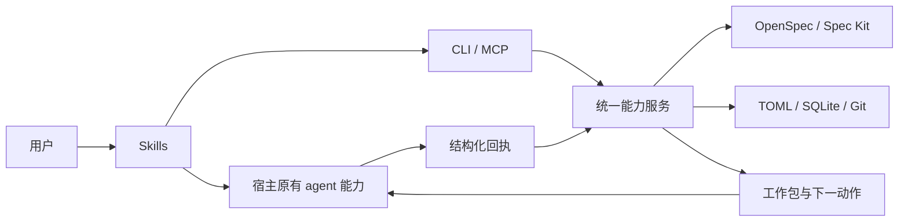

# Host-driven 架构

`0.1.0-alpha.2` 的主从关系：宿主负责 LLM 会话，Spec Autonomous 提供无模型调用的确定性能力。旧 alpha.1 的 agent runner 已移除；历史结果只读保留。能力清单以 [catalog.rs](../crates/core/src/capabilities/catalog.rs) 为准，协议以实际类型和测试为准。



## 模块与边界

| 模块 | 职责 |
| --- | --- |
| discovery / provider / markdown | 定位原生项目、读取原生工件和指令、结构化解析、源身份与 CAS |
| model / config / plan | 版本化类型、配置合并、roadmap 范围、DAG、源覆盖和冲突规则 |
| work_packet | 生成不可变 input/prompt/result schema，读取回执；没有进程启动方法 |
| engine/host | 请求、领取、心跳、回执 intent、幂等提交和宿主停止确认 |
| engine/lifecycle / planning / execution / recovery | 有限推进、规划批次、原生流程、验证/集成、修复与恢复 |
| capabilities | 完整能力与细粒度工具共享服务、参数校验、查询视图和归档操作 |
| mcp / CLI | 参数与协议适配；不各自实现工作流逻辑 |
| git / state / process | Git 和事务、单写锁、明确的框架/验证/钩子子进程控制 |
| progress / provenance | 只读进度、声明与观察分离的执行证据索引 |
| skills / skills_mcp | 文件所有权、可选宿主绑定、升级与卸载 |

CLI 不包含 Codex/Claude SDK 或 agent executable 选择器。Git、原生框架及已配置验证命令仍是必要的确定性操作；这不提供任意模型启动入口。Agent 会话、认证、上下文生命周期和取消由宿主负责。

## 数据权威

- 原生 Markdown/YAML 工件继续拥有产品规范、设计、原生任务和质量门的权威。
- `.spec-autonomous/config.toml` 和 `milestones/<id>/milestone.toml` 保存编排声明；ROADMAP.md 是生成视图。
- SQLite 保存 run、attempt、host request、回执状态、证据、intents 和 events。并发或完成状态不能仅从文件 checkbox 推断。
- Git common-dir 的仓库锁覆盖所有 linked worktrees。每次修改命令持锁；等待 LLM 时 CLI 已退出，不持有锁。
- 归档操作使用 common-dir 下的独立持久 operation journal 与隔离 candidate，确认 native 操作完成后再 fast-forward。

```text
.spec-autonomous/
  config.toml
  skills-installed.toml / mcp-installed.toml
  milestones/<id>/{milestone.toml,ROADMAP.md,roadmap.sha256}
  plans/<milestone>-<phase>.toml
  archives/<operation>.toml
<git-common-dir>/spec-autonomous/
  state.db / registry.toml / coordinator.lock
  operations/<id>.json
  worktrees/<run-or-request-or-operation>/
  runs/<run>/attempts/<request>/
    input.json / prompt.md / result.schema.json
    context-full.json                  # 超内联预算时
    result.json                        # CLI 写入的 canonical receipt
    execution-evidence.json            # audit 证据索引
```

SQLite schema 为 2。首次升级对非空旧库创建一致性备份；较新 schema 拒绝写入。旧 CLI 不能写新的账本。旧 run 的 host 字段为空，新 CLI 允许查询但拒绝重新激活其旧执行流程。

## 工作包协议

`prepare` 根据原生工件与 ledger 推进，遇到语义工作时返回 `awaiting_host`。工作类型包括 roadmap、native-planning、plan-tasks、implement、audit、converge。它们都由宿主执行。

每个请求包含：request/run/task/phase ID、随机 token、input SHA256、assigned project/worktree、base commit、结果 schema、fresh-context 要求、超时/剩余预算，以及必要的原生环境提示。Token 用于所有权与重放防护，不在普通 progress/next 中公开。

宿主领取请求时提供 `{host_id, session_id, fresh_context:true}`；会话身份必须跨请求唯一。该身份可以是宿主分配的工作会话标识并映射到原生 task handle。CLI 校验声明和一致性，不声称观察了宿主内部的真实上下文创建过程。Spec Kit 的 environment_hints 绑定本次 worktree，不指向用户原始 feature 路径。

输入文件和引用文件不可变；超出内联上限时，完整 WorkerInput 保存在带 SHA256 的文件中。默认内联 128 KiB、源上下文 2 MiB、planner 每批 32 个原生任务，audit 每批 32 个验收引用。这些限制不等于宿主模型最终 token 用量的硬限制。

## 回执与并行

1. 宿主完成语义工作，将 WorkerResult 和相同 token/身份交给 apply-result。
2. CLI 验证 schema、IDs、input hash、所有权、上下文新鲜性和结果大小。
3. 先保存 receipt intent，再原子写 canonical result，再保存 submitted。
4. 按原生输出/写集检查实际 worktree diff；模型返回“成功”不会直接建立完成状态。
5. 对 worker revision、组合 candidate revision 执行验证，确认验证过程没有改树。
6. 记录集成 intent，原生 checkbox CAS，推进 accepted revision，更新 ledger。
7. 继续确定性步骤，返回下一批工作、handoff、阻塞或最终结果。

相同回执重提幂等；不同 bytes 或不同 owner 被拒绝。receiving 中断可重提原结果；source writeback、Git advance、ledger finalize 之间沿用 durable-intent reconciliation。所有权从未因心跳过期自动转让。

任务并发取 execution.max_workers 与 host.max_concurrency 较小值。DAG 和读写冲突决定就绪队列；未知写集串行。每个可写请求有独立 worktree，依赖任务只使用已接受 revision。一次 workflow 活跃期间不重复开启同项目工作流；linked worktree 查询看到同一账本。

`host.source_revisions` 跟踪进行中来源版本，`phase_hashes` 只记录已通过阶段验收的来源版本。规划完成不能产生阶段完成证据。手工编辑原生来源后，先停止旧 host work；完成但未采纳的旧回执保留为 superseded，再导入变更并重建受影响图。

## 完成、暂停与恢复

- `awaiting_host`：调用成功，等待宿主语义工作。
- `plan_ready` / `handed_off`：规划或原生交接完成，未表示实现通过。
- `scope_completed`：仅所选 from/to/only 范围完成。
- `completed`：全部里程碑的验证、原生验收与交付完成。
- `paused` / `needs_input` / `delivery_pending`：保留检查点与原因。
- `cancelled`：workflow 已取消；仍需宿主停止并确认 outstanding sessions。

next 是只读预览。pause/cancel 使用控制邮箱，可以中断 CLI 自己的验证进程；对外部 agent 只返回宿主动作。长工作通过 heartbeat 报告 liveness；stale 表示未知，不能视为已停止。work.revoke 需要 host_stopped 与原因。

非幂等原生 hook 结果不明时使用 hook.resolve 记录显式证据。完整修复上下文持久化，跨 prepare 调用不会重复增加 repair round 或重复调用同一逻辑 hook。

## 完整能力与高级工具

默认七个完整能力和 MCP 的一个 sa_tools 入口。细粒度工具包括 structured docs、roadmap、task/work、state、history、Git、worktree、verification、repair。目录声明输入 schema、读写属性和输出 envelope；写接口的参数在修改前验证。

读取默认摘要视图，细节按需查询。分页保留总数；字段投影错误明确返回，不能用空值代替未知字段。写操作不接受读取字段投影参数，避免发生修改后才因投影失败而误报。

MCP 是本地 stdio JSON-RPC，支持初始化、工具列表/调用、资源列表/读取和 EOF 退出；不提供 sampling、HTTP daemon 或 agent 启动。单个 stdio 会话按请求处理；共享库锁协调来自多个 CLI/MCP 进程的写入。

## 归档与工具写入

归档先生成 source/head/config-bound preview。OpenSpec 调用原生 archive；Spec Kit 搬移完整 feature 并保留未知指针字段。里程碑操作按拓扑顺序处理所有来源，再归档 roadmap。全部操作位于独立 candidate；失败保留该候选，原 checkout 不变。记录 verified 后才 FF；分支或 HEAD 改变进入 delivery_pending。重提相同 plan hash 可以完成中断的交付。

文档修改使用 expected_hash；frontmatter 修改保留 Markdown 正文字节和未知字段值。TOML 的结构化修改保留字段语义，不承诺保持原排版。roadmap 修改检查 DAG、源身份、范围和生成视图所有权。Git commit 只提交明确路径，保留其他已暂存内容。worktree 删除保护 dirty/locked/外部工作，分支和证据默认保留。

Doctor 只读；repair 仅支持列出的操作，带预览、CAS 和备份。不会猜测修复损坏 ledger，也不会自动解除宿主的文件权限或信任限制。
