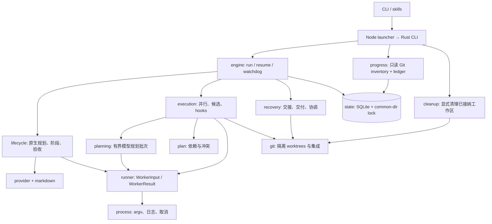

# 运行时架构

本文描述 `0.1.0-alpha.1` 开发线的当前实现，供维护者和 runner 接入者使用。它以 [Rust 代码](../crates/core/src/lib.rs) 和 [CLI 参数](../crates/cli/src/main.rs) 为准；最初的 OpenSpec design 保留产品目标与验收要求，不能代替已实现行为。实际版本以 `spec-autonomous --version` 为准，版本号不表示已经发布到 npm。

Spec Autonomous 是运行在用户现有 OpenSpec / Spec Kit 之上的本地协调器。Rust 决定下一步、启动 worker、执行验证、整合代码并保存恢复状态；worker 提供规划或实现候选。Node launcher 负责找到平台二进制、保留 argv/stdio 和退出语义；Bun 用于开发、依赖与发行脚本。运行时采用 Rust 标准线程与子进程，不需要常驻 daemon、模型代理服务或第二套规范框架。

## 模块与调用关系



| 模块 | 当前职责 |
| --- | --- |
| [CLI](../crates/cli/src/main.rs) | 参数选择、配置覆盖、格式输出、Ctrl-C、退出码；skills 和终端共用入口 |
| [engine.rs](../crates/core/src/engine.rs) | `start` / `resume_with` / `resolve_hook`、协调器锁、run 保存、attempt 创建、watchdog |
| [engine/lifecycle.rs](../crates/core/src/engine/lifecycle.rs) | roadmap、原生工件流程、phase 推进、host verification、scope audit、有界 repair |
| [engine/execution.rs](../crates/core/src/engine/execution.rs) | 任务计划、持续派发、候选集成、原生任务回写、converge 与 Spec Kit hooks |
| [engine/planning.rs](../crates/core/src/engine/planning.rs) | 将待做源任务拆成有界 fresh planner 批次，命名空间化内部 ID、补跨批依赖，再校验全局计划 |
| [engine/recovery.rs](../crates/core/src/engine/recovery.rs) | native handoff、最终交付、进程/intents/人工来源改动协调 |
| [provider.rs](../crates/core/src/provider.rs) | 原生来源选择、OpenSpec JSON bridge、Spec Kit 文档/模板、上下文和验收引用 |
| [markdown.rs](../crates/core/src/markdown.rs) | frontmatter、标题、任务身份/来源、框架专属解析、原文 CAS 回写 |
| [plan.rs](../crates/core/src/plan.rs) | 无副作用的 roadmap/DAG 校验、范围选择、读写集冲突与 ready 队列 |
| [runner.rs](../crates/core/src/runner.rs) | command / Codex profile、全新 attempt 输入、路径映射、结果 schema 与身份校验 |
| [process.rs](../crates/core/src/process.rs) | shell-free argv、stdout/stderr、deadline、取消、进程组/Job Object、身份协调 |
| [git.rs](../crates/core/src/git.rs)、[paths.rs](../crates/core/src/paths.rs) | Git root/common-dir、worktree/patch/commit/fast-forward、路径边界、hash、原子文件替换 |
| [state.rs](../crates/core/src/state.rs)、[model.rs](../crates/core/src/model.rs) | SQLite 与文件产物、数据结构、事务事件、控制请求 |
| [progress.rs](../crates/core/src/progress.rs) | 全 worktree 查询、来源记录与已验证计数分离、JSON/TOML/human 视图 |
| [cleanup.rs](../crates/core/src/cleanup.rs) | terminal run 的显式工作区清理；保留 integration、dirty/locked 工作区、外部分支和证据 |
| [skills.rs](../crates/core/src/skills.rs) | project scope 安装、Codex/Claude 宿主绑定、同义入口、文件 hash 所有权 |

这四个 `engine` 子模块是同一协调器的实现拆分，共享同一份 `Run`；它们不是四个独立 agent，也不各自拥有一套任务状态。`planning.rs` 组织模型调用，`plan.rs` 提供不触发模型、Git 或文件副作用的校验和调度函数。

## 数据权威与磁盘布局

| 数据 | 权威位置 | 更新者 |
| --- | --- | --- |
| 原生需求、设计、任务与约束 | OpenSpec / Spec Kit 原有 Markdown 及其规定的元数据 | 原生流程；自主运行时通过 provider 契约生成，协调器写完成标记 |
| milestone、phase 依赖、来源引用 | `.spec-autonomous/milestones/<id>/milestone.toml` | 协调器接纳 roadmap，或用户显式编辑并提交 |
| execution plan 与 source hash | `.spec-autonomous/plans/<milestone>-<phase>.toml` | planner 提议，Rust 校验后保存 |
| runner、验证命令、预算、hook binding | 用户级配置与项目 `.spec-autonomous/config.toml` 的合并结果 | 用户配置；启动时加 CLI 覆盖并快照进 run |
| attempts、已接受头、证据、intents、有效策略 | Git common directory 下的 SQLite | 持有 repository lease 的协调器 |
| 暂停/取消请求 | SQLite `controls` | 独立控制命令；不修改规范或执行计划 |
| roadmap/report 视图、输入、结果和日志 | TOML 旁的视图文件及 runtime 目录 | 协调器/对应 attempt；视图与文件存在本身不是完成证明 |

典型布局：

```text
项目根/
├── openspec/... 或 .specify/... + specs/<feature>/...
└── .spec-autonomous/
    ├── config.toml
    ├── skills-installed.toml
    ├── milestones/M001/
    │   ├── milestone.toml
    │   ├── ROADMAP.md
    │   └── roadmap.sha256
    └── plans/M001-P001.toml

<git-common-dir>/spec-autonomous/
├── coordinator.lock
├── registry.toml
├── state.db                  # 运行时可能同时出现 -wal / -shm
├── worktrees/<managed-id>/   # integration、worker、candidate
└── runs/<run-id>/
    ├── report.md
    └── attempts/<attempt-or-check-id>/
        ├── input.json        # worker 输入；host check 不需要此文件
        ├── context-full.json # 超出内联预算时保存完整输入，input 中附 SHA-256 引用
        ├── prompt.md
        ├── result.schema.json  # Codex profile 使用
        ├── result.json
        ├── process.json
        ├── stdout.log
        └── stderr.log
```

普通仓库的 common directory 通常是 `.git/`；linked worktree 的 `.git` 通常是指针文件。实现通过 Git 查询 common directory，从哪个 worktree 启动都不会另建一份运行账本。`init` 为声明文件设置 Git ignore 例外；runtime 放在 common directory，不随源码提交。现有忽略规则和密钥不应依赖此示意图猜测，实际以仓库配置为准。

当前数据库 schema 为 `1`，只有三张表：`runs` 保存序列化 `Run` payload，`events` 保存带序号的状态事件，`controls` 保存 run 的控制请求。attempt、plan、evidence 和 integration intent 目前是 `Run` 内的结构，尚未拆成独立 SQL 表。`save()` 将 run 更新与事件插入放进同一事务；数据库使用 WAL、`synchronous=FULL`，遇到更新 schema 拒绝打开，不自动降级。

协调器使用 common-dir 下的 OS 文件锁避免同仓双启动。`pause` / `cancel` 通过专门连接更新 `controls`，不会进行 schema 初始化或重写 registry。`registry.toml` 是可读索引，查询只使用固定的 common-dir `state.db`，不根据 registry 提供的任意路径读取其他文件。

## 实际 CLI 与配置

以下示例假设 CLI 已通过本地包或源码 launcher 可用、项目已有一个明确的 SDD provider。公共包是否发布见 [发行说明](distribution.md)。

```sh
spec-autonomous --path /path/to/repo detect --json
spec-autonomous --path /path/to/repo init --agent codex
# Claude 宿主可用 --agent claude；同名文件冲突时可用 --prefix sa

# 配好 runner/verification 并提交初始化文件后再执行
spec-autonomous --path /path/to/repo doctor --runner codex --json
spec-autonomous --path /path/to/repo --framework openspec inspect --change add-api --json
spec-autonomous --path /path/to/repo --framework openspec run --change add-api --max-workers 3 --json
spec-autonomous --path /path/to/repo --framework speckit run --feature specs/001-api --delivery branch --json
```

`init` 只绑定本产品 skills/commands 和项目配置，不安装或替换 SDD，不替用户配置模型认证。Codex 安装到 `.agents/skills/`，Claude 安装到 `.claude/commands/`；目前只支持 project scope。文件 hash 不再匹配时，升级/卸载保留用户改动。`autonomous` 是主入口，`auto` 是同义入口；CLI 的 `autonomous` / `auto` 都是 `run` 的 alias。

`.spec-autonomous/config.toml` 的最小 Codex 示例：

```toml
schema_version = 1

[runner]
profile = "codex"
command = ["codex"]
fresh_session = true
sandbox = "codex-native"

[execution]
mode = "autonomous"
max_workers = 3
max_attempts = 3
attempt_timeout_seconds = 1800
run_timeout_seconds = 28800
max_repair_rounds = 2
no_progress_limit = 2
delivery = "ff-original"
max_context_bytes = 131072
max_source_bytes = 2097152
max_planner_tasks = 32
max_log_bytes = 8388608

[[verification]]
argv = ["node", "--test"]
cwd = "."

[policy]
archive = false
push = false
publish = false
```

验证命令必须适合项目；示例假设项目确有 Node 测试。全局 `verification` 会进入每个任务、候选组合、phase 和 milestone 检查。只适合完整阶段的检查应放在 `Phase.verification`，只适合完整里程碑的检查放在 `Milestone.verification`；单任务检查由 `Task.verification` 提供。没有可运行检查时报告 `verification_missing`，不把 worker 的成功描述当作替代。

配置按 defaults → 用户级 TOML → 项目 TOML → 已提供的 CLI 选项覆盖。用户级路径为 `$XDG_CONFIG_HOME/spec-autonomous/config.toml`，未设置 XDG 时使用 `$HOME/.config/spec-autonomous/config.toml`。表按字段递归合并，数组整体替换，例如项目 `runner.command` 不会拼上用户级 argv，`verification` 也不会自动追加两份列表。

顶层与 `execution`、`runner`、`provider`、`policy`，以及嵌套的 hook binding 和 verification check 都拒绝未知键或非法类型；例如尚不支持的 `execution.max_tokens`，或把 `cwd` 拼成 `cwdd`，不会被静默忽略后继续运行。配置错误使用 `invalid_config`，不会把包含凭据的原始配置值拼进错误信息。`policy.archive` / `push` / `publish` 当前必须为 false，设置 true 会报告 `policy_capability_unavailable`，不能借配置开启未实现的外部生命周期。

run 保存有效配置，普通 `resume` 继续使用快照；显式 `--reload-config` 才按相同层次重新加载。resume 的执行模式仍由原 run 和显式 `--mode` 决定，不能把重载配置当成自动切换原生/自主模式。不要将凭据写入会提交的 TOML；子进程继承调用环境，`runner.environment` 中的显式值还会进入本地 run 快照。公开 status 的配置视图会隐藏 environment，完整本地日志不是通用凭据脱敏服务。

command profile 使用提供协议桥接的可执行程序：

```toml
[runner]
profile = "command"
command = ["/absolute/path/to/agent-bridge", "{input}", "{result}"]
fresh_session = true
sandbox = "runner-managed"

# 需要覆盖 OpenSpec 可执行程序时使用 argv 数组，而非拼接 shell 字符串
[provider]
openspec_command = ["node", "/absolute/path/to/openspec/bin/openspec.js"]
```

`{input}` / `{result}` 在单独的 argv 元素内替换，含空格路径仍保留参数边界。slash command 不是可执行程序。command profile 的 `fresh_session=true` 是桥接程序的契约声明；doctor 检查配置并拒绝显式 resume 参数，不能由此证明任意第三方 launcher 的全部语义。

## 里程碑、原生流程与阶段范围

```sh
# 会调用 roadmap worker，然后交出原生流程；默认也是 native
spec-autonomous --path /path/to/repo --framework openspec milestone new "完成 API MVP" --id M001 --mode native --json

# 从目标直接继续原生规划和开发
spec-autonomous --path /path/to/repo --framework openspec milestone new "完成 API MVP" --id M002 --mode autonomous --json

spec-autonomous --path /path/to/repo roadmap --milestone M001 --format toml
spec-autonomous --path /path/to/repo inspect --milestone M001 --phase P001 --json
spec-autonomous --path /path/to/repo run --milestone M001 --from P001 --to P002 --json
spec-autonomous --path /path/to/repo run --milestone M001 --only P002 --json
```

`run` 按显式 `--mode` → `--autonomous` → 合并配置的 `execution.mode` 决定模式；未配置时默认 autonomous。`--autonomous` 与 `--mode native` 冲突。CLI 的 `auto` / `autonomous` alias 采用同样的规则，不因命令别名而忽略项目模式。`milestone new` 仍默认 native，显式 `--mode autonomous` 才接着开发。

已有来源的 `run --mode native` 不派发实现 worker；从纯目标 `milestone new --mode native` 仍需要 roadmap worker 来生成路线，再交接。当前这些 engine 入口都要求 Git 初始提交、当前 branch 和干净工作区，不自动 stash/reset。`plan` 也不是纯查询：它在受管理工作区补齐必要原生规划、生成当前 phase 的执行图，然后按交付策略返回 `plan_ready`。

真实 milestone TOML 使用 `source.selector`：

```toml
schema_version = 1
id = "M001"
goal = "完成 API MVP"
framework = "openspec"
revision = 1

[[phases]]
id = "P001"
label = "1"
title = "数据与接口基础"
depends_on = []
source = { kind = "openspec-change", selector = "api-foundation" }

[[phases]]
id = "P002"
label = "2"
title = "集成与验收"
depends_on = ["P001"]
source = { kind = "openspec-change", selector = "api-integration" }
```

Spec Kit 的 source 为 `{ kind = "speckit-feature", selector = "specs/001-api" }`。一个 milestone 使用一种 framework，每个 phase 的 source 必须唯一。`from` / `to` 是声明顺序中的闭区间，支持稳定 ID 或唯一 label，`only` 与二者互斥；范围外依赖没有有效完成记录时拒绝执行。范围完成是 `scope_completed`，不会冒充完整 milestone 的 `completed`。

OpenSpec bridge 使用已安装 CLI 的 `list`、`status`、`instructions` 和 `new change`，根据 schema 返回的 ready artifact 与 output path 规划；保留 `skipped`/`skip_specs` 和唯一 tracking document 的约束。单次 provider 命令有 30 秒超时与 4 MiB 日志限制。外部 store/root、无法唯一识别 tracking document、原生任务数与解析结果不一致会报告能力或协议错误。

Spec Kit 当前 profile 是 feature-directory：显式 `--feature` 优先，其后为 `SPECIFY_FEATURE_DIRECTORY`、`.specify/feature.json` 的 `feature_directory`。已有规范读取不依赖 Python。缺工件时按 constitution → specify → plan → tasks 顺序，读取仓库已安装的 `speckit-<stage>` skill、Claude command 或 `.specify/templates/commands/<stage>.md`；缺原生契约就报告 `native_bridge_unavailable`，不会静默生成私有替代模板。未完成 checklist 阻止实现；任意 preset/extension 条件解释器和旧 branch profile 不在当前通用兼容承诺内。

## Worker 协议与上下文

每个 attempt 都有新的 ID、独立进程和只写一次的输入产物。`input.json` / `prompt.md` / `result.json` / `context-full.json` 任一已存在时，runner 拒绝复用该目录，不覆写旧证据。`WorkerInput` 包含 run/task/attempt 身份、kind、goal、framework、base commit、当前 instruction，以及按需要提供的 task、native snapshot、milestone 和上次失败摘要。它不包含主协调器完整对话或其他 worker 的完整日志。

Rust 协调器本身不是长期 LLM 会话；它维护结构化状态和磁盘引用。随着执行推进，数据库、完整 status 和 attempts 历史会增长，不能把“不继承会话”误解成全部运行历史都受一个固定 32 KiB 上限约束。

command worker 收到 prompt stdin，并可通过以下环境变量定位文件：

- `SPEC_AUTONOMOUS_INPUT`：本次 JSON 输入。
- `SPEC_AUTONOMOUS_RESULT`：必须写入的结果 JSON。
- `SPEC_AUTONOMOUS_ATTEMPT`：本次 attempt 身份。

内联输入接近 `max_context_bytes` 时，runner 为 prompt 包装预留字节，并将映射后的完整 `WorkerInput` 写入本次 attempt 的 `context-full.json`。精简后的 `input.json` 将完整数据定位到 `snapshot.metadata.context_reference`：

```json
{
  "context_reference": {
    "path": "/absolute/git-common-dir/spec-autonomous/runs/run-example/attempts/attempt-example/context-full.json",
    "sha256": "完整文件字节的 SHA-256"
  }
}
```

精简包清空内联 `snapshot.context_files` / `snapshot.tasks`，用引用替换 metadata，并从包中移出 milestone；原始内容仍完整保存在引用文件中。command bridge 必须识别这个字段、核对 hash、读取完整请求后工作，不能把精简包的空任务数组当作没有任务。Codex 收到相同的必读指令。当前完整 prompt 也检查字节上限；缺 snapshot 的过大 goal/envelope，或仍放不下的最小引用包会明确报 `context_too_large`。

这里的“不可变”指 attempt 写入与复用契约、文件 hash 和读取校验，不表示操作系统强制只读。引用让初始请求有界，不代表 worker 随后通过工具读取文件时的全部模型上下文也被限制在相同字节数。

结果最小形状如下，ID 必须从实际输入复制：

```json
{
  "schema_version": 1,
  "run_id": "run-example",
  "task_id": "task-example",
  "attempt_id": "attempt-example",
  "status": "candidate",
  "summary": "已完成指定任务，等待 host 验证",
  "blockers": [],
  "milestone": null,
  "plan": null,
  "audit": []
}
```

roadmap worker 返回 `milestone`，任务 planner 返回 `plan`，audit worker 返回 `{requirement,evidence,passed}` 列表。audit 目前每批最多 32 个 acceptance refs，这是固定批量，不使用 `max_planner_tasks`。每批都是新的 audit attempt，先核对该批准确 ID 和非空证据，最后再对合并结果验证整个 snapshot 的完整覆盖；不接受任意自造 ID、漏项或重复项。worker 只能返回 `candidate` / `blocked` / `failed`；后两者或非空 blockers 进入 `needs_input` 路径，不允许 worker 自称 `verified` / `integrated`。

Codex profile 当前组装的调用为：

```text
codex exec --ephemeral --json --sandbox <read-only|workspace-write>
  --output-schema <attempt/result.schema.json>
  --output-last-message <attempt/result.json> -
```

roadmap、plan-tasks、audit 使用 read-only，其余写入任务使用 workspace-write。`runner.command` 在此 profile 只能指定 executable，模型配置沿用用户原生 Codex 设置；`runner.sandbox` 是报告字段，实际传入的 sandbox 由任务种类决定。doctor 的帮助文本探测和结构化结果校验不等同于真实模型验收。

Spec Kit worker 的 `SPECIFY_INIT_DIR` / `SPECIFY_FEATURE_DIRECTORY` 被映射到本次 worktree；OpenSpec 返回的来源 root 和指令路径也映射到 worker root。必需规则按已知原生目录和允许扩展名复制到隔离工作区，不复制 `node_modules` 或整个用户目录。

默认 `max_context_bytes=131072` 限制内联请求和最终 prompt，`max_source_bytes=2097152` 独立限制 provider 读取的单文件及每次原生 snapshot 的文件内容总量；两者按字节计算，不能互当 token 上限。超过内联预算可通过完整上下文引用继续，超过来源读取上限仍须调整来源范围或显式配置。单结果文件上限 64 KiB、单 summary 8 KiB、每路日志默认 8 MiB；当前没有精确 token/cost 计量，统一报告 `usage: unavailable`。日志通过轮询发现超额后终止进程，不能承诺文件从不短暂超过阈值。

`max_source_bytes` 不是完整 `context-full.json` 的文件大小上限：JSON 元数据、转义及完整 milestone 汇总多个 phase 后还会增加体积。读取边界与内联 prompt 边界必须分别判断。

## 并发、验证与代码整合

task plan 保留 `source_ids`、依赖、reads/writes 和 verification。Rust 校验来源覆盖、ID、无环、保留路径和原生顺序约束；Spec Kit 的 `[P]` 不能覆盖实际文件冲突。未知 writes 串行；写写/写读和目录/glob 重叠采用保守冲突判定。ready 队列在容量允许时继续补位，无需等整批最慢任务结束。

`engine/planning.rs` 先取未完成的原生任务，按 `execution.max_planner_tasks` 顺序分批，默认 32、允许 1–128。每批 planner 只被授权覆盖该批 source IDs，并使用 fresh attempt；原生 tracking 文件即使包含更多任务也不扩大本批范围。每批独立校验来源覆盖、内部依赖和验证命令，多批时 host 重写内部 ID 以免重名，并让下一批根任务依赖上一批所有末端任务。最终还要对完整原始 snapshot 做一次全局 DAG/覆盖校验，保留 source IDs。

这些规划批次当前顺序调用，跨批 barrier 也会使后续实施批次等待前批完成；这是有意保守的并行边界。批内符合依赖和写集约束的任务仍可并行。`max_planner_tasks` 限制一次模型规划的任务量，不是 `max_workers` 的别名，也不保证任意复杂任务都会自动拆成合适的规模。

普通 worker 始终从当前 `accepted_head` 创建独立 worktree，分支为 `codex/sa/<managed-id>`。host 从实际 Git diff 校验写集和原生上下文保护；worktree 隔离工作文件，不限制任意第三方进程访问整个主机。需要进程安全边界时依赖实际 agent sandbox，不能靠 prompt 或 Git 分支冒充。

实现任务的接纳顺序：

1. 校验结果身份和实际 diff；拒绝修改原生上下文、共享 tracking 或其他项目路径。
2. host 将 worker 改动形成提交，并运行任务检查。
3. 从最新 accepted head 创建 candidate worktree，保存 `IntegrationIntent(state=prepared)`。
4. 应用 worker patch，保存 candidate commit；在组合后的代码上重跑本任务、全局及当前 phase 已接纳任务的检查。
5. 所有映射子任务满足时，在 candidate 中对原 tracking 文档做身份与原文 CAS 回写。
6. 保存含 `final_head` 的 verified intent，再 fast-forward integration worktree；最后事务更新 `accepted_head`、逻辑完成任务和 attempt 状态。

验证记录包括 argv、cwd、被测 commit、exit code、日志路径/hash、时间与 `tree_unchanged`。验证命令修改 HEAD、tracked 或未忽略文件时，旧证据失效并拒绝接纳；需要输出构建产物的检查应使用项目正常的忽略规则。

`accepted_head` 是协调器接纳的工作基线，包含已接纳的规划/规则提交，也可能包含 resume 导入的人工基线；是否已经满足某项验收仍需查对应 evidence、phase 与任务状态。未通过验证的 task candidate 不推进 accepted head，其他独立任务不从失败候选启动。

## Intents、人工修改与恢复

SQLite 无法与 Git 建立一个原子事务。当前实现把任务集成的 expected/candidate/final heads、状态和 attempt ID 放在 `Run.intents`，并使用 `Spec-Autonomous-Intent` commit trailer 便于审查。恢复按持久化状态与实际 HEAD 协调，不依据最新提交或复选框自行猜测成功。

| 意图或边界 | 当前恢复行为 |
| --- | --- |
| 原生来源创建 | 先记录 `source_create_intent`，调用原生创建，再提交并记录完成；重新读取 provider 状态判断工件阶段 |
| task candidate | `prepared` / 未验证意图不会被补记成功；恢复将其 abandoned，保留工作区 |
| verified integration | integration 仍在 `expected_head` 时推进到已记录的 `final_head`；已经等于 final head 时补记状态；其他 HEAD 报 `recovery_conflict` |
| 人工来源变更 | 在新 candidate 中合并已提交、未重写的 origin 历史，形成 `baseline_ready` intent；重新读取来源并使相关计划/phase 证据失效 |
| 最终交付 | 先保存 `delivery_intent`；若崩溃后 origin 已在 accepted head 且干净，恢复交付状态，不重复开发 |
| lifecycle hook | 保存逻辑 hook key 与 intent；非幂等 hook 的未知结果进入 `hook_outcome_unknown`，不能直接重跑 |

当前不声称所有 Git/文件副作用窗口均可自动修复。无法由持久化 intent 与实际 HEAD 唯一解释的提交会保留现场并报告 `recovery_conflict`；不能手工把它改成 completed 来绕过证据。

`ff-original` 交付复核 origin HEAD、branch、clean 状态和已捕获来源；用户改动导致 `delivery_pending`，保留 verified integration branch。`branch` 交付保留本地结果分支，不更新原 checkout。两者都不自动 push、发布、部署或归档 OpenSpec。

native / plan handoff 输出可继续操作的 integration checkout。应先提交原生修改再恢复：

```sh
spec-autonomous --path /path/to/repo status --json
spec-autonomous --path /path/to/repo report run-example --json
spec-autonomous --path /path/to/repo resume run-example --mode autonomous --json

# 显式调整后续策略：增加总期限、任务重试上限，或重读项目配置
spec-autonomous --path /path/to/repo resume run-example --extend-seconds 600 --max-attempts 5 --json
spec-autonomous --path /path/to/repo resume run-example --reload-config --json
```

`extend-seconds` 增加保存的总运行期限，已消耗 elapsed 不清零。普通 resume 保留 run ID、已有证据和范围，不创建同目标的新 run。completed、scope_completed、cancelled 是 terminal；对 terminal run 调用 resume 直接返回既有结果。

Spec Kit hook 从 `.specify/extensions.yml` 解析并映射到配置的 argv，例如：

```toml
[hooks."project.verify"]
argv = ["node", "scripts/verify-hook.mjs"]
idempotent = false
```

仅支持当前 profile 已实现阶段的 before/after events；mandatory binding 缺失或 condition 无桥接就阻塞。hook 收到 `SPEC_AUTONOMOUS_HOOK_KEY`，可由外部幂等实现使用；`idempotent=true` 是配置声明，不会让任意外部副作用天然 exactly-once。after hook 改变代码时重新验收。

未知结果需先检查 hook 实际影响、提交 integration 中的改动，再登记有证据的结果：

```sh
spec-autonomous --path /path/to/repo resolve-hook run-example \
  --key 'P001/before_implement/project.verify' \
  --outcome completed --evidence '已核对该次操作的结果与提交记录'
spec-autonomous --path /path/to/repo resume run-example --json
```

`--key` 必须取自实际 run 的 hook 状态，converge key 还带 repair round。`--outcome not-run` 只用于已确认未发生操作的情况；该接口记录操作者提供的事实，不替代最终代码验收。

## Watchdog 与子进程生命周期

coordinator 的 watchdog 线程持有只读 Store，每约 25 ms 检查 run 剩余期限与 controls；即使主协调器正阻塞在同步规划、audit、hook 或验证命令，也能设置共享取消标志。进程层轮询该标志、attempt deadline 与日志大小，执行层负责收回仍在途的 worker。这里是轮询周期，不是严格的 25 ms 响应 SLO。

```sh
spec-autonomous --path /path/to/repo pause run-example
spec-autonomous --path /path/to/repo cancel run-example
spec-autonomous --path /path/to/repo progress --all-worktrees --json
```

`pause` 会停止当前自主推进并取消在途进程；它不是“所有任务自然完成后再暂停”的 drain 操作。`cancel` 最终使 run terminal。Ctrl-C 设置同一取消标志，协调器落为可检查的暂停状态。OpenSpec bridge 还有独立的 30 秒命令期限，不应将所有 provider I/O 都描述为与 worker 相同的立即取消保证。

Unix 子进程位于独立进程组，超时/取消先 TERM 再 KILL；正常 leader 退出后也清理后代。恢复核对 PID、启动身份和进程组，身份无法确认时报错，避免误发信号或同时启动替身。Windows 实现包含 Job Object 和失败清理，但其重启身份恢复仍采取保守拒绝，不能据 Unix 测试宣称 Windows unattended execution 已通过。

进程层移除外层 Node test/IPC 与 Git 工作区选择变量，防止嵌套 `node --test` 假绿或测试运行到错误索引。argv 不经 shell 解释；用户明确配置的 shell executable 仍按它自己的语言执行。相关负面场景见 [测试说明](testing.md#node-ipc-环境的假绿回归)。

## 只读进度与错误接口

`progress` 默认枚举同一 Git common directory 的所有 worktree，`--all-worktrees` 明确表达这一范围；managed integration、candidate、worker 和 external 都保留。外部 worktree 缺乏本产品 metadata 时显示 unknown；失效进程显示 stale，缺失路径可显示 prunable。逻辑完成任务按 milestone/task 去重，不按尝试或工作区数量累加。

查询先后读取两次 Git inventory，用变化与坏账本/registry 诊断标记 partial。SQLite 与 Git 不是跨系统一致快照，因此返回 `snapshot_id`、时间和 `consistency`。它不持有 coordinator 写锁、不初始化缺失 DB、不调用 provider/agent、不修复或删除 worktree。

`native_progress` 当前来自最近持久化 `input.json` 的 source snapshot，带 `availability=recorded`、`observed_at` 和 source revision；它可能落后于用户刚编辑的 Markdown。规划分批前保留 `snapshot.metadata.native_counts.total` / `checked`，查询优先使用这两个原生来源总数，避免把最后一批的任务数当作整个 phase 的总量；没有该字段的旧记录退回 snapshot 内的任务计数。

若输入采用完整上下文引用，progress 只读取该 attempt 固定位置的 `context-full.json`，校验 SHA-256 后再提取 source snapshot，不跟随任意引用路径；读取限制为 16 MiB，损坏或缺失时报告 `invalid_context_reference` 与 partial。没有记录时返回 unavailable。需要查询当前原生内容使用 `inspect`；OpenSpec inspect 会调用其只读 JSON 命令，因此与无 provider 调用的 progress 不同。

查询支持 `--format human|json|toml`，`--json` 是 JSON 别名。公共 JSON/TOML 视图移除 null 字段，保留字符串 ID 与 unavailable 语义。detect 保留原有 report 形状；其他查询使用 `schema_version` 加 `data`/`error` envelope。run/resume/milestone 的 JSON 输出是 NDJSON 事件及最终结果，不能把整段输出作为一个 JSON 对象解析。

| 结果 | CLI 退出码 |
| --- | --- |
| 查询成功，或 completed / scope_completed / handed_off / plan_ready | `0` |
| 参数/选择/通用操作错误 | `2` |
| 顶层缺工具、缺配置或 unsupported 能力 | `3` |
| 已建立 run 后的 paused / needs_input / delivery_pending 等未完成状态 | `4` |
| 其他顶层错误 | `5` |
| run cancelled | `130` |

底层原因应读取 `error.code`，或最终 run 的 `status` / `blocker`。例如 `source_drift` 要先保存人工改动并重新协调，`verification_mutated_tree` 要修正修改被测树的检查，`no_progress` / `attempts_exhausted` 要检查失败证据，`run_already_active` 要查看既有 run，`process_identity_unknown` 要确认旧进程状态。相同底层错误发生在启动前和已建立 run 后，退出码可能不同，不应只依靠一个数字决定“自动重试”。

## 显式清理与保留边界

```sh
spec-autonomous --path /path/to/repo cleanup run-example --json
```

cleanup 取得同一 repository lease，只接受 completed、scope_completed 或 cancelled 等 `Run::terminal()` 返回 true 的 run。它从该 run 已 accepted/integrated 的 attempts 和 accepted intents 中选择工作区，检查路径位于 common-dir 的 `spec-autonomous/worktrees/`、存在于 Git inventory、branch 为 `codex/sa/`，最后使用不带 force 的 `git worktree remove`。

integration checkout 始终保留；dirty 或 locked 工作区进入 `retained`。external worktree、failed/interrupted attempt 和 abandoned candidate 不进入清理候选；Git branch refs、SQLite、输入/结果/日志等证据都保留。返回 `removed`、`retained`、`integration_retained`、`branch_refs_retained` 和 `evidence_retained`，不会把清理伪装成任务或验收进度。它是显式操作，不是自动 GC，也不是删除 run 历史的接口。

## 能力与验收边界

本实现提供本地单 coordinator、多 worker 的闭环；不提供跨主机调度、NFS/共享盘协调、通用分布式租约服务、自动升级所有上游 integrations 或任意 hook 条件解释器。工作区默认保留用于恢复和审查，仅在显式 cleanup 时按上述边界删除；没有自动垃圾回收，也不会自动安装每个 worktree 的项目依赖。

路径检查和真实 diff 校验能阻止错误整合，不构成完整 OS 沙箱。command profile 的新会话与沙箱取决于已配置 launcher，Codex profile 的实际权限由当前 Codex CLI 支持和策略决定。测试配置、成功构建、worker candidate、原生 checkbox 或模型自报通过都不能单独证明整个里程碑完成。

本地 mock、真实 Git/SQLite、OpenSpec 接口契约和进程回收的复现方法见 [testing.md](testing.md)。真实 Codex 的 OpenSpec 全流程、Spec Kit 现成规范执行需要各自的独立结果记录；本文不预先宣称这些外部模型验收通过。远程 CI、Windows/Linux/其他架构、最低 OS/glibc 与真实 npm 发布同样应以实际执行证据为准。

## 审核运行过程的证据

`provenance.rs` 为每次 audit 写独立、不可变的 execution-evidence.json；snapshot.metadata.execution_evidence 只提供路径、SHA256、run/head/profile 与数量。完整证据连接已结束的非 audit attempts、input/result/执行日志的 hash、独立 worktree、起止时间和 host verification。Codex 的 thread.started header 提供实际 session ID；command runner 没有该信号时标为未观察，不把 fresh_session 声明伪装成已观察的 session。不会把 runner 环境值放入这个索引。

Verifier 遇到“确实沿原生流程执行”“使用 fresh worker”等目标要求时可以读取该记录核实，不能只从最终代码反推过程。原始日志仍留本机，是否存在已知敏感内容取决于外部工具输出；索引不会宣称完成通用日志秘密识别。未提供证据的审查会阻塞，不放宽验收目标。

Native planning 的 Spec Kit sidecar 契约包括 checklist 和 research/data-model/quickstart/contracts；feature.json 在集成前恢复。复制 ignored context 时排除 dotenv、私钥扩展和常见 auth/credentials/secrets/tokens 存储文件名；这不是任意内容的秘密扫描器，敏感配置应继续使用 runner 的环境来源。
