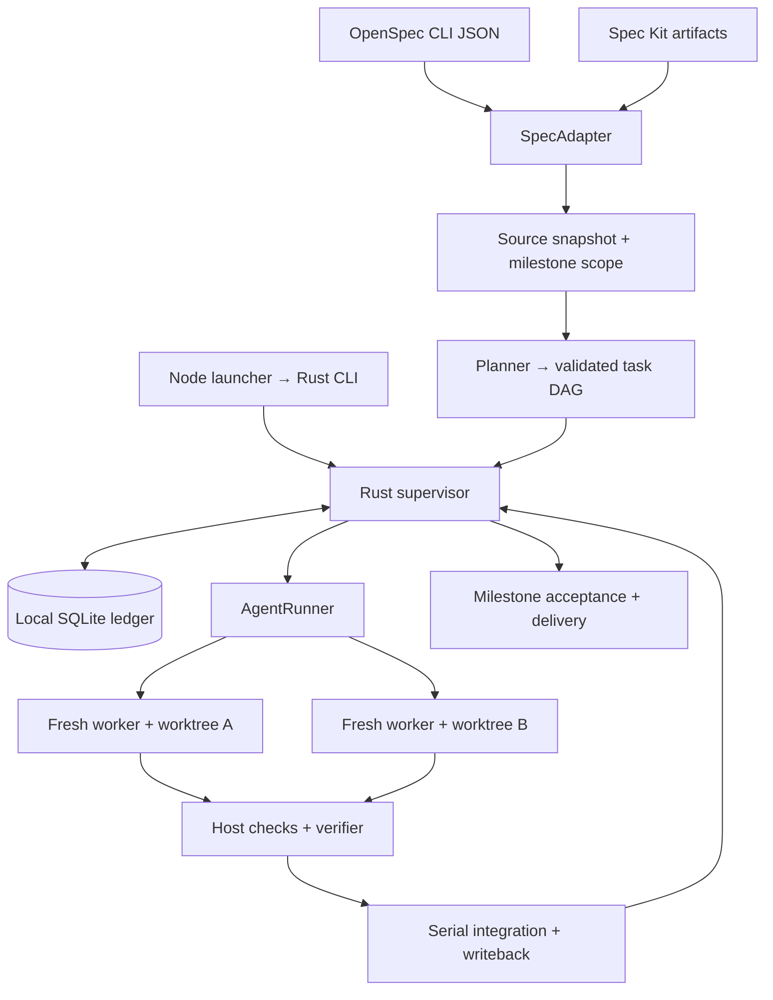

# Spec Autonomous：整里程碑自主开发技术方案

状态：**规划完成，runtime 待实现**。日期：2026-09-10。本次交付为调研、工程初始化和此方案；适配基线见 [upstreams.lock.json](../../../docs/research/upstreams.lock.json)。

## 1. Context 与产品承诺

**用户用 OpenSpec / Spec Kit 规划好一个里程碑，然后启动一次，系统自主把它开发到验收完成。** 正常任务交接、测试失败后的范围内修复、后续任务派发均无需用户再次输入“继续”。并行 agent 是加速手段，主逻辑线程负责里程碑进度、决策与恢复。

OpenSpec 有工件 DAG 和 JSON 指令；新版 Spec Kit 已有 workflow、fan-out、resume 和 converge。本项目交付跨这些来源的任务级自主闭环，包括隔离、验证、受控集成和可恢复推进。借鉴 GSD 的 auto loop、fresh session、小摘要、host 验证，不引入整套 GSD harness。源码证据见 [研究汇总](../../../docs/research/README.md)。

首版一个 OpenSpec change 或一个 Spec Kit feature 对应一个完整 milestone，覆盖其中全部任务和需求验收。后续可用显式 manifest 聚合多个 change/feature。产品规划仍由上游工具完成；执行层可以自动拆任务和补技术修复，不得悄悄新增产品需求。

## 2. Goals / Non-Goals

目标：自动推进整个已规划里程碑；每任务新上下文；安全地并行独立工作；复用现有规范；失败可恢复；npm 安装提供原生 CLI，用户无需 Rust/Bun/Python 或数据库服务。

首版不做 GUI/TUI、云协同、知识图谱、模型路由平台、浏览器 daemon、完整 IDE、无限自主需求生成或全 vendor 兼容。不 fork 上游规范框架。Git worktree 只隔离工作文件，不被宣传为 OS 沙箱。

## 3. 用户流程与 CLI

除 detect 外，下列接口均待实现：

```sh
spec-autonomous detect --json
spec-autonomous inspect --framework openspec --change add-team-auth --json
spec-autonomous doctor --runner command --json

# 无有效执行计划时自动导入已有规划并完成执行层拆分
spec-autonomous run --framework openspec --change add-team-auth --autonomous --max-workers 3
spec-autonomous run --framework speckit --feature specs/001-auth --autonomous --max-workers 3

# 可选：先查看可复用的执行图
spec-autonomous plan --framework openspec --change add-team-auth --json
spec-autonomous run --plan .spec-autonomous/plans/<plan-id>.json --autonomous
spec-autonomous status [run-id] --json
spec-autonomous pause <run-id>
spec-autonomous resume <run-id>
spec-autonomous cancel <run-id>
spec-autonomous report <run-id>
```

默认前台运行，status 可从另一进程读取账本，无常驻 server。resume 使用原 run、选择与授权策略，不新建相同里程碑。多框架/多 feature/多 change 必须确定选择，非交互返回候选和 selection_required，不猜最新编号。`--feature` 相对项目根解析，ID 缩写仅唯一匹配时使用。

新增 JSON 命令使用 `schema_version`、`data` 或 `error{code,message,details}` envelope；`run --json` 为明确声明的 NDJSON 事件流，诊断走 stderr。bootstrap detect 已有独立 report 形状，后续保持兼容。退出码计划：0 成功（detect inventory 可以为空/歧义），2 参数/选择/协议，3 缺工具或能力，4 暂停/需要输入，5 失败，130 用户中断；详细理由在 JSON 中。

## 4. Architecture 与模块接口



| 接口 | 职责 | 不承担 |
| --- | --- | --- |
| SpecAdapter | detect/select/inspect/snapshot/context/prepare_writeback | 模型运行、并发调度 |
| AgentRunner | probe/start_fresh/events/cancel/collect_result | 决定任务或里程碑完成 |
| Supervisor | DAG、状态机、预算、leases、验证、集成、恢复 | 复制上游模板系统、累积全量对话 |

确定性 Rust 控制流拥有状态。语义分析交给短生命周期 planner/verifier/repair agent，它们返回结构化提议，host 校验后执行。无需一个永不结束、无限增长的主 LLM 会话；主线程由 milestone snapshot、decisions 和有界 summary 维护。

core 内先按 discovery、adapters、plan、scheduler、runner、state、workspace、verification、report 分模块，边界稳定后再拆 crate。CLI 用 clap；计划 runtime 用 Tokio、rusqlite bundled、serde、内容 hash、Markdown parser。DAG 可先做小型拓扑实现，只有复杂度需要时才引入图库。Git 用已安装 CLI argv 调用，避免引入完整 Git 库。新增 runtime 依赖在实现阶段引入。

采用独立 Rust 二进制，不使用 N-API，避免 Node ABI 和 Bun runtime 绑定。Node 只选择平台、转发参数/stdio/退出码/信号。npm 发行细节见 [distribution.md](../../../docs/distribution.md)。

## 5. Adapter 契约与支持范围

`detect(root)` 只读；`select(root, selector)` 固定来源；`inspect(selection)` 返回 readiness/capability；`snapshot(selection)` 返回 source artifacts/tasks；`context(task, snapshot)` 构造输入；`prepare_writeback(task, expected_revision)` 产生 patch intent，唯一 coordinator 应用。

Readiness 必须分开 framework_detected、planning_ready、execution_supported、policy_ready。目录存在不代表可以自主开发。协议允许未知字段，缺失必需字段就失败。记录 upstream CLI version 和仓库模板/脚本 fingerprint，不能用全局新版本推断旧项目行为。

| 能力 | OpenSpec 首个执行版本 | Spec Kit 接入版本 |
| --- | --- | --- |
| marker 检测 | 已实现 | 已实现 |
| 任务/上下文导入 | 本地 change、CLI JSON | 显式 feature、文档解析 |
| 完成回写 | 单一具体 tracking file | tasks.md，保留原生 task ID |
| 根定位 | repo-local；外部 store 报不支持 | 项目子目录+feature；跨根先拒绝 |
| 自定义 workflow | capability probe 成功才运行 | mandatory hooks 未实现时阻塞 |
| 完成验收 | strict spec validation + 代码/需求验证 | 规范约束 + 代码/需求验证 |
| 附加能力 | 自定义 schema 按能力声明 | native workflow/hooks/converge 分别声明 |

### OpenSpec

固定本地可执行文件，探测 version 和 JSON shape，使用 `list --json`、`status --change ... --json`、`instructions apply --change ... --json`，必要时读取 `instructions <artifact> ...`，以 `validate <change> --strict --json --no-interactive` 检查规划。

`isPlanningComplete`/兼容 `isComplete` 是工件就绪；apply 的 all_done 是 checkbox 全勾，均非代码完成。默认 apply 只 gate tasks 文件，额外检查工件依赖与 strict validate。零任务、progress.total 与任务列表不一致、缺 tracking 契约不被当成功。

上游 skip_specs:true 的 skipped 工件满足对应依赖，不应强制生成不存在的 spec；fixtures 要区分合法跳过与真正缺失工件。

使用返回 root.path、changeDir、planningHome 和 contextFiles，不凭 cwd 拼目录。realpath 必须在授权项目内；首版遇 store/global default 重定向报 external_spec_root_unsupported，不改写外部路径来勉强继续。支持单个具体 apply.tracks，glob/多 tracking 文件显式拒绝。

运行后在 integration checkout 根调用 OpenSpec 查询最新状态；原 checkout 的 source snapshot 仅作漂移检查。contextFiles 的返回绝对路径必须映射为当前 attempt worktree 的同源相对路径，或显式 immutable 规则快照；不得让 worker 按旧绝对路径读写原 checkout。校验映射后仍在允许根内，每个 task 输入固定其 source revision。

CLI task ID 可能是临时序号，Markdown 1.1 只是描述的一部分。内部 ID 首次导入时由 source identity、文本 fingerprint 和消歧标识建立，持久化后按唯一来源匹配；不用行号/ordinal 作持久主键。上游会计数代码块中的 checkbox 等特殊条目，adapter 保留差异诊断，不能悄悄过滤后宣布完成。

### Spec Kit

文档 adapter 不要求 Python。读取 feature 的 spec、plan、tasks、constitution、相关 contracts 和只读 checklists。当前 profile 的选择顺序：显式 --feature、SPECIFY_FEATURE_DIRECTORY、.specify/feature.json；SPECIFY_FEATURE 仅是标签，不能定位 feature。旧 branch profile 另做固定 fixtures，未验证前不承诺。

每 worker 重映射 project/feature 绝对路径，不能指回主 checkout；不竞争写 feature.json。Git ignored 的 .specify/.agents 规则按 allowlist 快照注入，避免新 worktree 丢失约束；不复制 secrets 或依赖目录。

解析 task ID（不限三位数字）、phase、story、checkbox、描述、来源范围。保留 Setup/Foundational barrier、story 依赖、Polish 和 Independent Test。[P] 只是并行候选，仍受写集和前置条件控制。模板/注释示例不当任务；与 OpenSpec parser 差异分 adapter 处理。

detect 不执行仓库脚本。optional native bridge 的 paths-only JSON 可帮助诊断，但普通 prerequisite 调用可能写 feature.json；必须明确其副作用。mandatory hooks/checklists 未实现或未满足就执行前阻塞。feature hook 只由 coordinator 执行一次，worker 不运行整套 implement。converge 追加任务先经范围校验和图 revision，再进入相同自主循环。

这里“一次”是一次逻辑生命周期操作，不能靠进程成功假设外部副作用 exactly-once。hook 同样记录 intent/attempt/result；仅具备幂等 key 或可查询结果的 hook 可自动重试。调用已发生但结果无法判定时进入 hook_outcome_unknown，不重复执行也不当作成功。after hook 若修改代码，使旧验收证据失效并重新验证。

## 6. 稳定任务图与合理拆分

先从现有约束构造保守图，再启动 fresh planner 补写集、输入、验证与子任务。规划层不重写产品 spec。每内部任务有明确成果、写入范围与验收；超大 upstream task 可拆多个内部任务，所有子任务集成且原任务验收通过才勾父 task。

```json
{
  "schema_version": 1,
  "plan_id": "plan-01",
  "revision": 1,
  "milestone": {"framework": "openspec", "selector": "add-team-auth"},
  "source_snapshot": "sha256:...",
  "tasks": [{
    "id": "task-auth-model",
    "source_refs": [{"file": "tasks.md", "source_key": "source-01", "text_hash": "sha256:..."}],
    "depends_on": [],
    "reads": ["src/domain/**"],
    "writes": ["src/domain/user.rs"],
    "verification": [{"argv": ["cargo", "test", "user_model"], "cwd": "."}],
    "acceptance_refs": ["specs/auth/spec.md#user-model"],
    "max_attempts": 3
  }]
}
```

host 验证 ID 唯一、引用存在、无环、所有待做来源 task 被覆盖、任务不越 scope、路径规范化、验收可运行。planner 的“已完成”字段不能跳过来源任务。source 重排、插入、重复或改写无法唯一映射时 replan。

调度条件：依赖已集成并验证、容量与预算足够、无写-写/写-读冲突。glob 的祖先目录、共享 lockfile、公共接口、migration 视为冲突；未知写集取得全仓独占 token。先保证语义正确，再按关键路径和稳定原始顺序派发。允许持续补位，不强制每 wave 等最慢任务。

默认 max_workers=3，planner/verifier 也占 agent 配额。每次从已验证的 accepted_head 创建普通 worker，以带上依赖结果；未验证 candidate_integration_head 不对普通 worker 可见。实际 diff 超出写集则拒绝集成、调整计划并串行重试；文本 merge 无冲突不能代替接口依赖检查。失败下游等待修复，独立任务可从 accepted_head 继续；全局权限/预算/规范漂移则停止新派发。

## 7. 整里程碑自主循环

```text
preflight planned scope + runner + policy
import source snapshot; reuse or derive valid execution graph
while milestone is not terminal:
    reconcile completed attempts and unfinished integration intents
    validate candidate result; run host verification
    integrate valid work serially; verify combined revision
    write back satisfied source tasks in integration checkout
    classify failures; enqueue bounded in-scope repairs
    dispatch ready tasks while worker capacity and budget permit
    if all tasks satisfied:
        run milestone acceptance and spec/code scope audit
        if in-scope gaps: revise repair graph and continue
        if all conditions pass: deliver and complete
    await active work when useful progress remains
    otherwise persist precise blocker and pause/fail
```

首版要求规划达到 adapter readiness；缺规划返回可操作诊断，不暗中编造新需求。可选未来 prepare 可桥接上游规划流程，但不改变“规划后自主开发”的主流程。常规技术拆分、任务交接和可修复失败不询问用户。

初始默认：每 task 最多 3 attempts、每 attempt 墙钟 30 分钟、run 墙钟 8 小时、milestone repair rounds 最多 2，可在启动时一次配置。token/cost 预算只有 runner 能可靠计量时启用；未知显示 unavailable，不能记零。

编译/测试/契约差距 → fresh repair；集成冲突 → 范围受限 conflict task；短暂网络/限流 → 有限退避；鉴权/缺工具 → paused；新增需求/验收矛盾/新权限 → needs_input。同一 failure fingerprint 且无代码/证据进展达 2 次，或预算耗尽，停止重试并保存恢复点。

如果原来的 checkbox 全勾但无账本证据，先审核当前代码与 milestone acceptance，成功才记录 observed-complete。零任务是 no_executable_tasks，不是自动成功。完成同时要求：原始范围全部覆盖、所有必须任务集成、回写一致、命令验证和需求审核通过、无 blocker、最终交付成功。

## 8. Fresh context 与 runner 协议

首个 runner 为 command profile：调用用户已安装且已认证的非交互 agent launcher。具体 vendor profile 经真实 CLI 版本验证后支持；slash commands 不是可执行程序。profile 定义 executable、argv 模板、stdin/input file、result file、允许环境、fresh/headless/cancel/usage 能力。

argv 只按参数替换，不经过 shell。显式项目验证脚本可包含必要 shell 逻辑，但不从模型文本拼接命令。doctor 检查工具版本、新会话、禁止隐式 resume、非交互和取消能力；不具备新会话语义的 runner 不宣称 fresh-context 支持。先用 deterministic fixture runner 验证状态机，再用真实 agent 的小仓库验证集成；两者证据分开。

每 attempt 产生 immutable input.json/context.md，含 scope、单任务、验收、base commit、worktree、相关 spec/plan/规则、依赖摘要、写集和结果 schema。默认无主对话、旧 session ID 或其他 worker 完整报告。重试也是新会话，只接收必要失败摘要和证据路径。

建议输入预算 24k tokens，summary ≤8 KiB，result JSON ≤64 KiB，主摘要 ≤32 KiB；完整日志单独落盘并设配额。token 估计须标明；必需规则不能静默截断，超预算先拆任务，仍超出就报告 constraint。主线程持有决策索引，通过引用按需读取。

```json
{
  "schema_version": 1,
  "run_id": "run-01",
  "task_id": "task-auth-model",
  "attempt_id": "attempt-01",
  "status": "candidate",
  "base_commit": "...",
  "summary": "Added model and unit checks",
  "claimed_changed_files": ["src/domain/user.rs"],
  "evidence_refs": ["logs/unit-test.txt"],
  "blockers": []
}
```

worker 只能报 candidate/blocked/failed，不能宣布 verified/integrated。host 验证身份与 attempt nonce、结果大小/schema、路径边界、真实 diff；重跑必要命令，不信自报 exit 0。完整日志不回填主上下文。

Unix 使用进程组，Windows 使用 Job Object 等价机制清理子孙进程。SIGINT 停派、落盘、graceful cancel，超时 kill；未通过真实平台进程回收验证前不声称支持 unattended 执行。不能留后台 agent 继续改文件。

## 9. Worktree、验证集成与交付

run 要求 Git 有初始 commit 且选定 checkout 干净；列出 dirty 文件，不自动 stash/reset。记录 origin HEAD/branch、Git common dir 和 source snapshot。创建 codex/sa/<run-id> integration branch/worktree，worker 分支追加 task/attempt；worktree 放受管理 Git common dir 路径，避免递归落进源码树。

每写 worker 独立 worktree。允许规则快照只读提供，不共享可变 task 状态。host 从实际 diff 收集变更，控制集成提交；不信任 worker 给出的任意 commit hash。规范名称不能注入 Git 选项或穿越路径。

**运行中回写在 integration worktree**，验证后的代码和满足的任务清单由 coordinator 提交；原 checkout 到最终交付才统一更新。status 明确实时进度和 integration path，原 tasks 文件是起点快照。原规范被人工编辑时 source drift 检查触发 replan，不能覆盖用户改动。

worker 验证通过后按确定顺序集成，并在组合后的 revision 重新验证；依赖只由 integrated 解锁。冲突保留现场并尝试受限 repair，不 force merge 或猜 ours/theirs。独立分支的旧验证不能当组合验证。

集成维护 accepted_head 与 candidate_integration_head 两个明确指针。先在隔离候选工作区应用结果并验证，成功后才推进 accepted_head；失败候选与 conflict/repair worker 留在其独立工作区，其他普通任务只读 accepted_head。已接受头变化时，旧候选须重新基于新 accepted_head 应用和验证。账本恢复必须保留这一区分，不能以 Git 最近提交自动替代已验收头。

默认 delivery=ff-original：最终验收通过后复核原分支仍在起点、checkout 干净、source hash 一致，fast-forward 原分支和工作区；全程由 run lock 保护。用户若已移动分支或修改文件，状态为 delivery_pending，保留已验证分支，不标 completed。启动时可选 delivery=branch，以交付已验证本地分支为完成定义，报告明确结果位置。

push/PR/部署/publish/归档按一次性运行 policy 授权处理，已有授权不重复问；新动作需要具体授权才暂停。OpenSpec 归档默认关闭，不将实现完成等同应归档。

worktree 不是 OS sandbox。runner 复用其权限/沙箱，autonomous 不自动设置 unrestricted/yolo。diff 检查能拒绝集成，不能追溯阻止无沙箱进程的系统越界写入；doctor 明确实际限制。

## 10. SQLite 账本与崩溃恢复

采用 SQLite + 文件产物，单 coordinator 写库，读 status 可并发。attempt/task/lease/evidence 的事务需求比多 JSON 文件的自制一致性更简单；bundled SQLite 无外部服务，JSON/Markdown 是投影。

```text
.spec-autonomous/
  config.toml
  state.db
  plans/<plan-id>.json
  runs/<run-id>/
    source-manifest.json
    decisions.md
    attempts/<attempt-id>/{input.json,result.json,stdout.log,stderr.log}
    report.md
```

Git common dir 下的仓库级 OS lock 覆盖 linked worktrees，记录 ledger canonical path，防止不同启动目录用不同账本双写。worker 不写库。首版不支持 NFS/共享盘多机账本，诊断后拒绝。

表：runs（选择/policy/状态/origin 与 accepted/candidate heads/预算）、source_revisions、plans、tasks、edges、attempts（session/PID/起止/结果）、leases、evidence、integration_intents、hook_attempts、events（单调 seq）。DB schema version 与应用版本独立；migration 前备份、事务迁移，遇更新版本 DB 拒写。

Run：preparing → running → verifying_milestone → delivering → completed；可进入 paused/needs_input/failed/cancelled/delivery_pending。Task：pending → ready → running → candidate → verifying → integrating → integrated；失败进入 retry_wait/blocked/failed。retry 新增 attempt，不覆盖历史。

SQLite 无法与 Git 原子提交。副作用使用 durable intent + reconciliation：

1. 事务登记 intent、expected HEAD、source revision、patch hash。
2. 集成提交 trailer 带 run/task/attempt/intent ID；记录 actual HEAD 与验证证据。
3. source checkbox CAS：唯一 key、原文 fingerprint、当前文件 hash 全匹配才改；保留 CRLF/其他内容，原子替换，生成受管理 writeback commit。
4. 事务更新 integrated/final HEAD/source hash，释放 lease。

若 2/3 后、4 前崩溃，resume 查询 trailer、祖先关系、tree hash 和源内容后补记，不盲目重做 cherry-pick 或回写。只有 intent 无副作用才重试；无法唯一判断时暂停保留证据。写文件使用同目录临时文件、flush、rename，并验证各平台持久性。

恢复先核对 origin/source、runner 进程身份（PID+启动标识）、leases、Git HEAD 和 intents。lease 过期不代表进程已死，不能同时启动重复 attempt。checkbox 为 X 但无可核验提交/证据时必须重新审核，不能自动补记完成。

## 11. 验证、repair 与完成报告

四层验收：结果协议/实际 diff；worker revision 上的 task 验收；组合 revision 上的 integration 验收；原始 scope 上的 milestone acceptance + 需求审核。命令证据存 argv、cwd、code revision、exit、时间和日志 hash。缓存只在 revision/命令/环境 fingerprint 相同可复用；源码、依赖或配置变化使相关证据失效。

语义 verifier 输出 requirement-to-evidence 映射、缺口和无法确认项，host 依据必须条件判定。不能只测试代码不对照需求，也不能只检查规范格式不测试实现。修复范围限原始 spec；补技术测试/修 bug 可自动进图，新需求需用户决定。converge 或 task 追加由 coordinator 形成新 source/plan revision，再继续同一循环。

报告包含 milestone、状态、origin/final commit、完成与阻塞任务、验收矩阵、证据、重试和耗时、已知 token/cost 或 unavailable、结果分支与下一动作。未跑平台/外部模型/端到端检查必须明确，不伪装为通过。

## 12. 配置、自主授权与预算

优先级：CLI > 项目配置 > 用户配置 > defaults。secret 不进仓库，使用已认证 agent 或显式环境来源；日志脱敏，不把 credential 填进 prompt。

```toml
schema_version = 1
[execution]
mode = "autonomous"
max_workers = 3
max_attempts = 3
attempt_timeout_seconds = 1800
run_timeout_seconds = 28800
max_repair_rounds = 2
delivery = "ff-original"
[runner]
profile = "command"
[policy]
archive = false
push = false
publish = false
```

有效 policy 快照保存在 run，resume 默认继承。普通代码编辑、测试、已授权集成和修复不重复确认。范围外动作、必要新决策或预算增加才请求用户；允许的独立任务仍可推进。未提供可靠 usage 的 runner 禁止声称 dollar/token budget 已被强制执行。

## 13. 版本路线与 OpenSpec 推进

| 阶段 | 交付结果 | 验收出口 |
| --- | --- | --- |
| M0 bootstrap（本次） | 检测 CLI、Rust/Bun/npm、研究与方案 | 本机构建/测试/tarball 安装/spec validate |
| M1 OpenSpec autonomous slice | 一个 change 完整自主开发，初期单 worker | fixture 端到端 + 至少一种真实 agent launcher |
| M2 reliable parallel autonomy | 独立 worktree 并行、repair、完整恢复 | 冲突/源漂移/kill 窗口/组合验证/无进展测试 |
| M3 Spec Kit parity | 相同循环驱动完整 feature | phase/story/[P]/路径/writeback/hook 能力测试 |
| M4 public npm alpha | 平台包、安装 smoke、可复现发布 | 六平台原生 CI 与真实 npm 安装/registry 完整性 |

M1 先证明“启动一次，自动完成整个任务集”，M2 在同一完成语义上增加并行，M3 不另造循环。具体任务见 [tasks.md](tasks.md)。本仓库使用官方 spec-driven，bootstrap 完成后归档进主规范；本变更保持开放，直到实现与对应验收全部完成。无需自定义 schema。

## 14. 测试与验收矩阵

单元测试覆盖检测/解析/source map/DAG/冲突/状态/预算；固定 upstream commit 的契约 fixtures；临时 Git 仓库 + deterministic runner 的集成测试；小型真实模型验收独立记录。fixture 成功不替代实际模型完成证据。

| 场景 | 必须观察到 |
| --- | --- |
| 三任务里程碑，中间编译失败 | 自动修复并继续，不问用户“继续吗” |
| 两独立任务、一个依赖任务 | 前两个可并行，后一个等集成 |
| 同文件/未知写集/[P] 冲突 | 串行并解释原因 |
| worker 自报成功但验证失败 | 不勾选、不解锁依赖、有界 repair |
| 候选组合失败时启动独立任务 | 只从 accepted_head 启动，不读失败候选补丁 |
| 子任务全绿但父验收失败 | 父 task 不完成，继续修复 |
| 全部旧 checkbox 为 X | 审核实际代码与整体验收 |
| Git 副作用后、DB 提交前 kill | resume 协调，不重复集成 |
| 人工修改 source/原 checkout | replan/delivery_pending，保留改动 |
| 100 个 fixture tasks | 主摘要守上限，worker session 全唯一 |
| 超预算/鉴权/重复失败 | 精确 paused reason，无无限调用 |
| 外部 OpenSpec store/未知 tracks | capability error，无越界写 |
| Spec Kit mandatory hook 未满足 | 启动前阻塞，不静默绕过 |
| hook 已执行但落库前崩溃 | 幂等协调或 hook_outcome_unknown，不盲目重跑 |
| npm 禁 lifecycle scripts | 仍能运行正确平台 binary |

性能先测基线：detect 冷启动/内存/包体，1 与 3 workers fixture 墙钟、摘要字节数、恢复时间。记录真实数据后再确定 SLO，不保证模型任务并行必然更快。

## 15. Risks / Trade-offs 与开放项

- 上游漂移 → 固定 fixtures + runtime capability probe；检测支持和执行支持分开。
- 写集推断遗漏 → 保守串行、真实 diff 边界、重新规划，接受部分并发损失。
- SQLite/Git 无跨系统事务 → intent/trailer/reconciliation，歧义暂停。
- 测试不完备 → requirement-to-evidence 审核，不宣称数学正确性。
- runner 权限和 session 语义不同 → doctor 明确 profile 能力，不假定普遍一致。
- 平台发行成本 → 本机只证明 macOS arm64，其他需原生 CI。

可后置：公开品牌/npm scope、首个官方 vendor runner、最低 OS/glibc 版本、multi-change manifest。当前以暂定包名、command profile、能力矩阵与单成员 milestone 隔离这些选择，不阻塞 bootstrap 或本方案。
