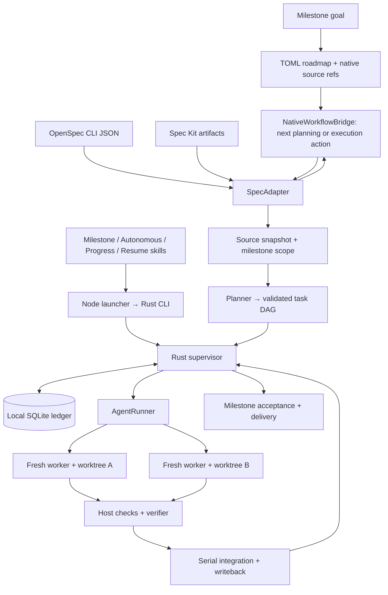

> 历史 alpha.1 方案：CLI agent launcher 的职责已由 [host-driven-capabilities](../host-driven-capabilities/design.md) 替代。保留此前验收和未完成发行项，不以旧模型运行记录证明新 host 协议。

# Spec Autonomous：整里程碑自主开发技术方案

状态：**本地 runtime 已实现，验收与发行状态见清单**。更新：2026-09-11。实际模块、配置与协议见 [architecture.md](../../../docs/architecture.md)，本轮证据见 [验收记录](../../../docs/validation/autonomous.md)。适配基线见 [upstreams.lock.json](../../../docs/research/upstreams.lock.json)。

## 1. Context 与产品承诺

**用户给定里程碑目标，系统基于 OpenSpec / Spec Kit 原生流程规划 roadmap，再自主开发到验收完成；已有规划也可从当前阶段接入。** 用户可通过 skill 或 CLI 选择原生手动推进，或指定 from/to 范围自主推进。正常任务交接、范围内修复与后续派发无需反复“继续”；主线程维护里程碑和决策。

OpenSpec 有工件 DAG 和 JSON 指令；新版 Spec Kit 已有 workflow、fan-out、resume 和 converge。本项目交付跨这些来源的任务级自主闭环，包括隔离、验证、受控集成和可恢复推进。借鉴 GSD 的 auto loop、fresh session、小摘要、host 验证，不引入整套 GSD harness。源码证据见 [研究汇总](../../../docs/research/README.md)。

首版层级为 Milestone → Roadmap phases → 原生工件流程 → 执行 tasks。每个 roadmap phase 绑定一个 OpenSpec change 或一个 Spec Kit feature；已有单一来源可自动建立单 phase 映射。一个 milestone 首版选择一种 framework，多个 phase 可对应多个该框架的原生单元；跨 framework 混合 milestone 后置。目标/约束先确定，然后通过原生工件规范细化需求，不另造一套产品 spec 语言。原生任务文档内部的 Phase 标题与这里的 roadmap phase 是不同层级。

底层依赖的是**用户仓库本身的 SDD provider**：默认检测现有 OpenSpec/Spec Kit 配置、已安装 integration、schema/templates 和原生 artifacts，`--framework` 只用于明确选择。本工具提供 orchestration overlay，不内置一个在 provider 缺失时悄悄替代用户框架的 SDD 引擎。只有 TOML 执行计划而没有有效原生 provider/source 时不能启动；未检测到 SDD 时给出 setup/handoff 指引，由用户选择框架。

## 2. Goals / Non-Goals

目标：skill 驱动目标→roadmap→原生规划→实现的整里程碑闭环；按 from/to/only 运行阶段范围；原生/自主两种方式可交接；每任务新上下文与独立 worktree；失败可恢复；npm 分发原生 CLI 和配套 skills。读取与执行已有 Spec Kit 文档无需 Python，若选用上游初始化/模板解析 CLI bridge，则单独声明其运行时依赖。

首版不做 GUI/TUI、云协同、知识图谱、模型路由平台、浏览器 daemon、完整 IDE、无限自主需求生成或全 vendor 兼容。不 fork 上游规范框架。Git worktree 只隔离工作文件，不被宣传为 OS 沙箱。

## 3. 用户流程与 CLI

以下接口已在本地 alpha 实现，执行需现有 SDD、已配置 runner 和干净 Git 基线：

```sh
spec-autonomous detect --json
spec-autonomous init
spec-autonomous inspect --framework openspec --change add-team-auth --json
spec-autonomous doctor --json

# 从目标开始规划 roadmap，native 模式完成里程碑规划后给出原生下一步
spec-autonomous milestone new "MVP：团队邀请与权限" --framework openspec --mode native
# 同一入口可在规划后继续自主开发整个里程碑
spec-autonomous milestone new "MVP：团队邀请与权限" --framework openspec --mode autonomous
spec-autonomous roadmap --milestone M001 --format toml
spec-autonomous progress --all-worktrees
spec-autonomous progress --all-worktrees --format json
spec-autonomous run --milestone M001 --from 2 --to 4 --mode autonomous --max-workers 3
spec-autonomous run --milestone M001 --only 3 --mode autonomous

# 已有原生 change/feature 也能接入；自动补齐缺失规划工件
spec-autonomous run --framework openspec --change add-team-auth --autonomous --max-workers 3
spec-autonomous run --framework speckit --feature specs/001-auth --autonomous --max-workers 3

# 可选：先查看可复用的执行图
spec-autonomous plan --framework openspec --change add-team-auth --json
spec-autonomous run --plan .spec-autonomous/plans/<plan-id>.toml --autonomous
spec-autonomous status [run-id] --json
spec-autonomous pause <run-id>
spec-autonomous resume <run-id>
spec-autonomous cancel <run-id>
spec-autonomous report <run-id>
```

默认前台运行，status 可从另一进程读取账本，无常驻 server。resume 使用原 run、选择与授权策略，不新建相同里程碑。多框架/多 feature/多 change 必须确定选择，非交互返回候选和 selection_required，不猜最新编号。`--feature` 相对项目根解析，ID 缩写仅唯一匹配时使用。

`--mode native|autonomous` 是统一模式字段，原方案的 `--autonomous` 保留为别名；冲突参数报错。`milestone new` 默认 native：生成目标/roadmap 以及原生单元引用，交出下一步；显式 autonomous 才持续进入后续开发。`--from/--to/--only` 需要已存在的 roadmap，不能在尚未产生阶段时猜编号。

### 3.1 随 npm 发布的 skill 入口

| Skill（拟定名称） | 用户用途 | 对应引擎功能 |
| --- | --- | --- |
| milestone | 输入里程碑目标、研究并生成 roadmap，选择推进方式 | milestone new / 原生规划 bridge |
| autonomous（别名 auto） | /autonomous 或 /auto，运行完整 milestone 或 from/to/only 范围 | run / provider detection / 阶段路由 |
| progress | 汇总所有 worktree 的进度、阻塞、下一步；native 模式返回原生动作 | progress --all-worktrees / roadmap / workflow next |
| resume | 从原生或自主检查点继续，保留原选择与预算 | resume / 重新协调来源 |

例如在支持 slash command 的宿主中（Claude commands；Codex 使用 $name）：

```text
/milestone "MVP：团队邀请与权限" --mode native
/autonomous "完成本里程碑的团队邀请与权限 MVP"
/autonomous --milestone M001 --from 2 --to 4
/auto --milestone M001 --only 3
/progress --all-worktrees
/resume <run-id>
```

`/autonomous` 是主入口，`/auto` 为严格同义别名：参数、provider、scope、run ID 和 resume 均相同，不是另一条快捷执行逻辑。宿主 profile 支持命令 alias 时生成映射；只支持 skill 文件时生成最小 alias skill，引用同一 CLI handler 和资源，避免复制整套指令。

具体 `$name`、`/name`、command 文件或 skill 目录由宿主 profile 生成。仅支持 skills 的宿主使用其原生等价入口，如 `$autonomous` / `$auto`，不能声称 npm 可以改造宿主命令解析器。安装体验是 npm 安装 CLI 后，在仓库执行一次 `spec-autonomous init`：检测用户已有 SDD 和宿主，写本产品配置与 commands/skills 绑定，后续直接使用短命令。歧义时只要求选择，不替换既有框架。

skill 源码位于 `packages/cli/skills/<name>/SKILL.md`，配套 references 按需加载，npm files 和 release assembler 同时包含它们。底层 `skills install --agent <id> --scope project` 仍可显式使用；npm 全局安装本身不猜 cwd、不自动改仓库。init 是绑定编排工具，不自动迁移或重置 SDD。

installer 保存自有文件/版本/hash manifest；升级只覆盖未被用户修改的自有文件，碰到 /auto 等同名第三方命令或手写 skill 报冲突，可显式配置命名空间，绝不覆盖。uninstall 不删除其他 skill。现有 openspec-* 是上游集成，不是本产品入口，不能据此宣称 /autonomous 或 /auto 已交付。

skill 只负责识别用户意图、选择 milestone、展示必要决策和调用同一 Rust 协议；状态、预算和范围判定不能在 skill prompt 中再实现一份。每次只加载当前阶段所需 instructions，完整 worker 记录留磁盘。终端用户和 skill 用户得到同样的范围、检查点和完成语义。

### 3.2 Roadmap 与原生流程的关系

可版本化的声明保存在 `.spec-autonomous/milestones/M001/milestone.toml`，包含 goal/constraints、framework、稳定 phase IDs、显示标号、依赖和 source refs；ROADMAP.md 是可读视图。实现时调整 gitignore，仅排除 runtime DB/logs，不排除里程碑规划文件。manifest 是编排拓扑，产品需求、设计和任务正文仍在原生 Markdown，不能复制到私有 DB 后降为投影。配置与本产品新增编排数据优先 TOML；保留 OpenSpec 等上游规定的 YAML/frontmatter 格式。

```toml
schema_version = 1
id = "M001"
goal = "团队邀请与权限 MVP"
framework = "openspec"
revision = 1

[[phases]]
id = "P001"
label = "1"
title = "身份基础"
depends_on = []
source = { kind = "openspec-change", selector = "identity-foundation" }

[[phases]]
id = "P002"
label = "2"
title = "邀请加入团队"
depends_on = ["P001"]
source = { kind = "openspec-change", selector = "team-invitations" }
```

Spec Kit source 改为 `{ kind = "speckit-feature", path = "specs/002-team-invitations" }`。一个来源单元只归一个 roadmap phase，避免两个 phase 同时管理同一 tasks 文件。requirements/acceptance 用原生文件引用建立覆盖关系；goal 是授权边界，不是另一份竞争性产品规范。

先形成完整 roadmap 的目标、阶段和依赖，再按阶段按需生成细节计划；不必把所有后续 tasks 一次装入主上下文。默认不提前编写依赖于未完成接口的后续详细设计，允许独立研究重叠。ROADMAP.md 的机器生成状态不能覆盖手工编辑：检测到视图变更时保留并要求 reconcile 到 manifest，重生成前不静默丢弃。

### 3.3 from/to/only 的确定语义

与 GSD 的用户语义一致：from/to 指 roadmap phase，闭区间；only 只跑一个 phase，且与 from/to 互斥。支持稳定 phase ID 或唯一显示标号，标号按 manifest 顺序解析，不用浮点比较（3.1 与 3.10 不合并）。缺省 from 为首个未通过的 phase，缺省 to 为当前 roadmap 末尾；不存在、反向或歧义范围直接报错。

范围过滤不删依赖。选中 phase 若依赖范围外尚未完成的 phase，返回 prerequisite_outside_range 和需先完成的项；不越过依赖、不擅自扩大 from/to。已完成阶段仅在原生 source/revision 和验收仍有效时跳过，否则重验或 replan。

每 phase 结束重读 roadmap 与原生状态，记录 roadmap revision。新增阶段只有在原授权目标、依赖和选定边界内时才能自动纳入并记录原因；越界或语义变化暂停澄清，既不忽略也不自动扩大 scope。已绑定的范围端点用稳定 ID 保存，不能因插入阶段把 --to 的含义悄悄变掉。

到达 to/only 后，run 返回 scope_completed 与 next action，milestone 仍可 in_progress；不自动执行整个 milestone 的 audit/archive/cleanup，尤其不能把范围完成误标为全里程碑完成。完整运行才触发最终验收和已授权的 lifecycle。边界与 next action 在 resume 中保留。

### 3.4 原生与自主模式的交接

native 用户可以直接使用安装好的 OpenSpec/Spec Kit 命令或 skills 操作同一批原生 artifacts，完全不依赖本项目 runtime 持续在线。我们的 native 模式只读取进度、生成原生下一步指令/上下文并交出控制权，不隐式启动自动执行。卸载本产品后，用户仍能按其 SDD 框架继续工作；TOML overlay 的存在不是原生使用前置条件。

autonomous 模式消费同一 NativeWorkflowBridge.next_action，自动启动 fresh planning/execution agent、检查产物与门、推进下一阶段。OpenSpec 的 schema/template/context/rules，Spec Kit 的 constitution/templates/checklists/hooks 都保留；两种模式差别在推进与调度，不另写一套规划方法。

原生→自主：锁定当前原生文件与 Git revision，导入已完成工件、重验来源任务，再从缺失步骤开始；不要求重写既有 plans。自主→原生：停止派发并协调在途 worker，输出一个可直接操作的 planning/integration checkout 与明确原生命令；先安全交付 accepted checkpoint 或给出该分支路径，不能把用户送回仍过期的原 checkout。交接后释放运行锁，不允许两个 coordinator 同时写。

再次 resume 时重新读取该交接位置的 source，保留用户修改并废弃受影响的旧图/证据；相同内容不重跑，合法手工推进登记为 externally_observed，再做必要验收。来源文件的变化与实际代码完成分别核对，不能只靠 native checkbox 全勾跳过验证。

### 3.5 CLI 统一读取 TOML 与 Markdown 的结构化数据

所有 skills 和外部 agent 优先通过 CLI 读取结构化状态，不各自拼 shell/regex 扫全仓 MD。`progress` 面向所有 worktree，`status <run-id>` 面向单 run，`roadmap --milestone` 读取阶段，`inspect --milestone M001 --phase P001` 读取原生工件和任务。新增命令支持默认 human、`--format json`、`--format toml`；`--json` 为 JSON 别名，与冲突 format 同时出现时报错。detect 的既有 JSON 保持兼容。流式事件仍用 NDJSON，TOML 只输出完整快照。

| 数据 | 权威来源 | CLI 读取结果 |
| --- | --- | --- |
| 项目策略、runner/skill profile | config.toml 和相关 TOML | 有效配置、来源和能力 |
| milestone/phase 拓扑和 source refs | milestone.toml | roadmap/phase 依赖、阶段编号 |
| 规范、设计、原生 tasks | 上游 Markdown 与其规定的元数据 | requirements、scenarios、task IDs、checkbox、phase/story/frontmatter |
| attempts、leases、验证/集成事件 | 本地事务账本 | worker/task 状态与证据摘要 |
| 实际 worktree | Git worktree inventory | canonical path、branch/HEAD、locked/prunable/dirty 状态 |

Markdown 的结构来自 adapter profile：OpenSpec 的 Requirement/Scenario 标题、任务清单及 schema；Spec Kit 的 T-ID、[P]/[US]、phase、constitution；已存在的 YAML/TOML frontmatter 按原格式解析。不得要求用户把 spec 转成 TOML，也不为便于解析删正文、重排任务或统一替换原生 frontmatter。需要新增调度字段但上游没有扩展点时，写到 TOML sidecar，以稳定 source key 引用原始 MD。

规范文本和机器提取字段一起输出，附 `source_path`、`source_hash`、`source_span`、`parser_profile`、`diagnostics`。代码块/注释、重复 ID、未知 frontmatter 或解析差异有明确诊断，不能猜测为零任务。Structured view 是源文件的有 provenance 读取结果；写操作仍经过源版本检查。

JSON/TOML 两种表示遵守同一 schema_version。TOML 无 null，缺省字段用 omitted + availability/diagnostic 表达，不把 missing 变零或 false；IDs 和阶段标号保持字符串，时间统一 RFC3339 字符串。format 转换不能改变任务身份、依赖、unknown 状态或计数。

### 3.6 所有 worktree 的 progress

`spec-autonomous progress --all-worktrees` 从调用位置解析同一个 Git common dir，再用 Git worktree inventory 枚举全部 linked worktrees，包括主 checkout、managed integration、每个 worker、用户手工创建的 worktree。不从 cwd 单棵目录猜全局状态。全仓范围指这个 Git repository，跨不相关仓库聚合另做显式 workspace registry。

以 canonical worktree ID/path 关联本工具的 milestone/run/phase/task/attempt 元数据；同一 source/task 在原 checkout、integration 和多个 attempt 中可能出现多次，聚合任务按稳定逻辑 ID 去重。并发数按真实 live worker 计，重试次数单列；不同 milestone 不共享 task namespace。外部 worktree 显示 external/unmanaged，无法确认的运行状态显示 unknown，不推断它空闲或完成。

```toml
schema_version = 1
snapshot_id = "snapshot-01"
generated_at = "2026-09-11T05:00:00Z"
repository_id = "repo-01"
consistency = "consistent"
active_workers = 2

[[worktrees]]
id = "wt-worker-01"
kind = "managed-worker"
path = "/workspace/task-auth"
branch = "codex/sa/run-01/task-auth/attempt-01"
milestone_id = "M001"
phase_id = "P002"
run_id = "run-01"
task_id = "task-auth"
attempt_id = "attempt-01"
status = "running"
stage = "implement"
lease_state = "live"
accepted_head = "<commit>"

[[worktrees]]
id = "wt-user-01"
kind = "external"
path = "/workspace/manual-fix"
status = "unknown"
```

每行还可包含最近 heartbeat、验证结果、blocker、next action、source revision、candidate HEAD，避免把存在未通过候选的工作区显示为绿色完成。原生规划进度（文件/checkbox）与本工具验证进度分别列出，不将 MD 百分比当验收百分比。未初始化账本时仍列出 Git worktrees 和可读取的 native 状态，不因 absence 隐藏整个仓库。

只读 progress 不获取运行写锁、不调用 agent、不初始化/修复 worktree、不更新 checkout 的 MD。采用账本只读事务和有界 Git inventory；两者不是同一事务，输出 snapshot/time/consistency，检测并发增删、不可读或过期心跳时标 stale/partial 并保留诊断。不存在“查不到就零进度”的静默降级。

Git common dir 的 `spec-autonomous/registry.toml` 是已知账本位置和 managed worktree 关联的可读索引，由唯一 coordinator 原子更新；进程租约/成功证据仍以事务账本核验，registry 不是锁或完成证明。读方检查路径归属和注册身份，不能据被篡改 registry 任意读取宿主文件。Git inventory 与 registry 不一致时显示 orphaned/prunable/unregistered 诊断，自动清理属于独立显式操作。

新增 JSON 命令使用 `schema_version`、`data` 或 `error{code,message,details}` envelope；`run --json` 为明确声明的 NDJSON 事件流，诊断走 stderr。bootstrap detect 已有独立 report 形状，后续保持兼容。退出码：0 成功（detect inventory 可以为空/歧义），2 参数/选择/协议，3 缺工具或能力，4 暂停/需要输入，5 失败，130 用户中断；详细理由在 JSON 中。

## 4. Architecture 与模块接口



| 接口 | 职责 | 不承担 |
| --- | --- | --- |
| SpecAdapter | detect/select/inspect/snapshot/context/prepare_writeback | 模型运行、并发调度 |
| NativeWorkflowBridge | 解析原生阶段/skill/template、next_action、规划缺失工件、检查 stage gate | 另造产品规范语言、跳过上游必需约束 |
| AgentRunner | probe/start_fresh/events/cancel/collect_result | 决定任务或里程碑完成 |
| Supervisor | DAG、状态机、预算、leases、验证、集成、恢复 | 复制上游模板系统、累积全量对话 |

确定性 Rust 控制流拥有状态。语义分析交给短生命周期 planner/verifier/repair agent，它们返回结构化提议，host 校验后执行。无需一个永不结束、无限增长的主 LLM 会话；主线程由 milestone snapshot、decisions 和有界 summary 维护。

core 实际分为 discovery、config/model、provider/markdown、plan、runner/process、git/state、progress/cleanup/skills 和 engine。engine 再按 lifecycle、planning、execution、recovery 拆分。CLI 使用 clap；本地有界并发使用标准线程和消息/取消状态，未引入 Tokio。rusqlite bundled 提供事务，serde/TOML 提供协议，SHA256 提供 provenance。DAG 使用纯函数校验和就绪队列；Git 通过 argv 调用。模块职责与测试注入点见 architecture.md。

采用独立 Rust 二进制，不使用 N-API，避免 Node ABI 和 Bun runtime 绑定。Node 只选择平台、转发参数/stdio/退出码/信号。npm 发行细节见 [distribution.md](../../../docs/distribution.md)。

## 5. Adapter 契约与支持范围

`detect(root)` 只读；`select(root, selector)` 固定来源；`inspect(selection)` 返回 readiness/capability/next_action；`snapshot(selection)` 返回带 source provenance 的 artifacts/tasks；`context(unit, snapshot)` 支持规划或代码工作单元；`prepare_writeback(task, expected_revision)` 由唯一 coordinator 应用。NativeWorkflowBridge 将 inspector 的缺失工件转为可调度规划动作，只有明确用户决策、缺工具/能力或违反 gate 才阻塞。

Readiness 必须分开 framework_detected、planning_ready、execution_supported、policy_ready。目录存在不代表可以自主开发。协议允许未知字段，缺失必需字段就失败。记录 upstream CLI version 和仓库模板/脚本 fingerprint，不能用全局新版本推断旧项目行为。

| 能力 | OpenSpec 首个执行版本 | Spec Kit 接入版本 |
| --- | --- | --- |
| marker 检测 | 已实现 | 已实现 |
| milestone/phase 初始化 | 用户目标→roadmap→本地原生 changes | 用户目标→roadmap→原生 features |
| 原生规划驱动 | schema artifact DAG + instructions/templates | 已安装 integration skills/templates 的 specify/plan/tasks 等流程 |
| 任务/上下文导入 | 本地 change、CLI JSON 和 MD provenance | 显式 feature、结构化 MD 解析 |
| 完成回写 | 单一具体 tracking file | tasks.md，保留原生 task ID |
| 根定位 | repo-local；外部 store 报不支持 | 项目子目录+feature；跨根先拒绝 |
| 自定义 workflow | capability probe 成功才运行 | mandatory hooks 未实现时阻塞 |
| 完成验收 | strict spec validation + 代码/需求验证 | 规范约束 + 代码/需求验证 |
| 附加能力 | 自定义 schema 按能力声明 | native workflow/hooks/converge 分别声明 |

### OpenSpec

固定本地可执行文件，探测 version 和 JSON shape。只读使用 list/status/instructions 的 JSON；写入新 phase 时通过官方 new change 创建原生单元。读取 schema 的 artifact IDs/requires/outputPaths，从当前 ready 工件获取 instructions/template/context/rules，派发 fresh planning worker，在受控原生路径形成工件，检查后再查询下一步。不能硬编码所有自定义 schema 都是 proposal/specs/design/tasks；无法解释的必需能力明确报错。apply-ready 后才进入任务执行图，以 strict validate 检查合法规划。

`isPlanningComplete`/兼容 `isComplete` 是工件就绪；apply 的 all_done 是 checkbox 全勾，均非代码完成。默认 apply 只 gate tasks 文件，额外检查工件依赖与 strict validate。零任务、progress.total 与任务列表不一致、缺 tracking 契约不被当成功。

上游 skip_specs:true 的 skipped 工件满足对应依赖，不应强制生成不存在的 spec；fixtures 要区分合法跳过与真正缺失工件。

使用返回 root.path、changeDir、planningHome 和 contextFiles，不凭 cwd 拼目录。realpath 必须在授权项目内；首版遇 store/global default 重定向报 external_spec_root_unsupported，不改写外部路径来勉强继续。支持单个具体 apply.tracks，glob/多 tracking 文件显式拒绝。

运行后在 integration checkout 根调用 OpenSpec 查询最新状态；原 checkout 的 source snapshot 仅作漂移检查。contextFiles 的返回绝对路径必须映射为当前 attempt worktree 的同源相对路径，或显式 immutable 规则快照；不得让 worker 按旧绝对路径读写原 checkout。校验映射后仍在允许根内，每个 task 输入固定其 source revision。

CLI task ID 可能是临时序号，Markdown 1.1 只是描述的一部分。内部 ID 首次导入时由 source identity、文本 fingerprint 和消歧标识建立，持久化后按唯一来源匹配；不用行号/ordinal 作持久主键。上游会计数代码块中的 checkbox 等特殊条目，adapter 保留差异诊断，不能悄悄过滤后宣布完成。

### Spec Kit

文档 adapter 不要求 Python。从头创建/规划时使用经过探测的本地 Spec Kit integration skills 和解析后的项目 templates/preset/extension 契约，依次完成适用的 constitution/specify/clarify/plan/checklist/tasks/analyze；必需 gate 保留，可选步骤由原生配置及 run policy 决定。CLI bridge 的 Python/uv 依赖单独列入 doctor；缺 bridge 时仍可读取已有文档并交接原生下一步，不能声称从头规划已可用。

读取 feature 的 spec、plan、tasks、constitution、相关 contracts 和只读 checklists。当前 profile 的选择顺序：显式 --feature、SPECIFY_FEATURE_DIRECTORY、.specify/feature.json；SPECIFY_FEATURE 仅是标签，不能定位 feature。旧 branch profile 另做固定 fixtures，未验证前不承诺。

每 worker 重映射 project/feature 绝对路径，不能指回主 checkout；不竞争写 feature.json。Git ignored 的 .specify/.agents 规则按 allowlist 快照注入，避免新 worktree 丢失约束；不复制 secrets 或依赖目录。

解析 task ID（不限三位数字）、phase、story、checkbox、描述、来源范围。保留 Setup/Foundational barrier、story 依赖、Polish 和 Independent Test。[P] 只是并行候选，仍受写集和前置条件控制。模板/注释示例不当任务；与 OpenSpec parser 差异分 adapter 处理。

detect 不执行仓库脚本。optional native bridge 的 paths-only JSON 可帮助诊断，但普通 prerequisite 调用可能写 feature.json；必须明确其副作用。mandatory hooks/checklists 未实现或未满足就执行前阻塞。feature hook 只由 coordinator 执行一次，worker 不运行整套 implement。converge 追加任务先经范围校验和图 revision，再进入相同自主循环。

这里“一次”是一次逻辑生命周期操作，不能靠进程成功假设外部副作用 exactly-once。hook 同样记录 intent/attempt/result；仅具备幂等 key 或可查询结果的 hook 可自动重试。调用已发生但结果无法判定时进入 hook_outcome_unknown，不重复执行也不当作成功。after hook 若修改代码，使旧验收证据失效并重新验证。

## 6. 稳定任务图与合理拆分

区分三层图：milestone 的 roadmap phase 图、每个原生单元的规划工件图、phase 内的实现 task 图。先基于用户目标与约束生成有验收引用的完整 roadmap，再按原生工件流程细化各 phase；最后执行层 planner 补写集、输入、验证与子任务。实现层拆分不自行改产品 spec。每内部任务有明确成果、写集与验收，所有子任务集成且原任务验收通过才勾父 task。声明式计划保存 TOML，下面是 CLI JSON 读取视图。

```json
{
  "schema_version": 1,
  "plan_id": "plan-01",
  "revision": 1,
  "milestone": {"id": "M001", "phase_id": "P002", "framework": "openspec", "selector": "add-team-auth"},
  "source_snapshot": "sha256:...",
  "tasks": [{
    "id": "task-auth-model",
    "source_refs": [{"file": "tasks.md", "source_key": "source-01", "text_hash": "sha256:..."}],
    "depends_on": [],
    "reads": ["src/domain/**"],
    "writes": ["src/domain/user.rs"],
    "verification": [{"argv": ["cargo", "test", "user_model"], "cwd": "."}],
    "acceptance_refs": ["specs/auth/spec.md#user-model"],
    "max_attempts": 3
  }]
}
```

host 验证 ID 唯一、引用存在、无环、所有待做来源 task 被覆盖、任务不越 scope、路径规范化、验收可运行。planner 的“已完成”字段不能跳过来源任务。source 重排、插入、重复或改写无法唯一映射时 replan。

调度条件：依赖已集成并验证、容量与预算足够、无写-写/写-读冲突。glob 的祖先目录、共享 lockfile、公共接口、migration 视为冲突；未知写集取得全仓独占 token。先保证语义正确，再按稳定原始顺序派发。允许持续补位，不强制每 wave 等最慢任务。

默认 max_workers=3，planner/verifier 也占 agent 配额。每次从已验证的 accepted_head 创建普通 worker，以带上依赖结果；未验证 candidate_integration_head 不对普通 worker 可见。实际 diff 超出写集则拒绝集成，在原写集内有限 fresh 重试；文本 merge 无冲突不能代替接口依赖检查。失败下游等待修复，独立任务可从 accepted_head 继续；全局权限/预算/规范漂移则停止新派发。

## 7. 整里程碑自主循环

```text
resolve goal or existing milestone + mode + runner + policy
if roadmap is absent: derive roadmap and native phase references from goal
resolve bounded phase selection and outside-range prerequisites
while selected scope is not terminal:
    reread roadmap, native artifacts and accepted revision
    next = NativeWorkflowBridge.next_action(current_phase)
    if mode is native: return handoff path and original action
    if next requires a product decision: persist needs_input
    if next is planning: dispatch fresh planning agent using native contracts
    if next is implementation: import/reconcile phase task graph
    reconcile completed attempts and unfinished integration intents
    validate candidate result; run host verification
    integrate valid work serially; verify combined revision
    write back satisfied source tasks in integration checkout
    classify failures; enqueue bounded in-scope repairs
    dispatch ready tasks while worker capacity and budget permit
    if current phase tasks satisfied: verify phase, refresh roadmap, advance within range
    if bounded selection satisfied: deliver checkpoint and return scope_completed
    if full milestone satisfied:
        run milestone acceptance and spec/code scope audit
        if in-scope gaps: revise repair graph and continue
        if all conditions pass: deliver and mark milestone completed
    await active work when useful progress remains
    otherwise persist precise blocker and pause/fail
```

首版将原生规划作为自主循环的一部分。inspect 报缺工件和 next_action，autonomous 根据原生 workflow 补齐，implementation_ready 仍是代码派发门。目标不明确到需要产品取舍时集中询问必要决定；已授权边界内的常规规划、拆分、交接与修复自动进行，不把每个 artifact 都变成新的确认点。

初始默认：每 task 最多 3 attempts、每 attempt 墙钟 30 分钟、run 墙钟 8 小时、milestone repair rounds 最多 2，可在启动时一次配置。token/cost 预算只有 runner 能可靠计量时启用；未知显示 unavailable，不能记零。

编译/测试/契约差距 → fresh repair；集成冲突 → 范围受限 conflict task；短暂网络/限流 → 有限退避；鉴权/缺工具 → paused；新增需求/验收矛盾/新权限 → needs_input。同一 failure fingerprint 且无代码/证据进展达 2 次，或预算耗尽，停止重试并保存恢复点。

如果原来的 checkbox 全勾但无账本证据，先审核当前代码与范围验收，成功才记录 observed-complete。尚未规划 tasks 时继续 native planning；原生流程确认规划结束却仍无可执行任务才报 no_executable_tasks。scope_completed 要求所选阶段与交付验收通过；milestone completed 还要求整个 roadmap 与原始范围全部覆盖、最终验收通过，不能用局部任务计数替代。

## 8. Fresh context 与 runner 协议

首个 runner 为 command profile：调用用户已安装且已认证的非交互 agent launcher。具体 vendor profile 经真实 CLI 版本验证后支持；slash commands 不是可执行程序。profile 定义 executable、argv 模板、stdin/input file、result file、允许环境、fresh/headless/cancel/usage 能力。

argv 只按参数替换，不经过 shell。显式项目验证脚本可包含必要 shell 逻辑，但不从模型文本拼接命令。doctor 检查工具版本、新会话、禁止隐式 resume、非交互和取消能力；不具备新会话语义的 runner 不宣称 fresh-context 支持。先用 deterministic fixture runner 验证状态机，再用真实 agent 的小仓库验证集成；两者证据分开。

每 attempt 产生 immutable input.json/context.md，含 scope、单任务、验收、base commit、worktree、相关 spec/plan/规则、依赖摘要、写集和结果 schema。默认无主对话、旧 session ID 或其他 worker 完整报告。重试也是新会话，只接收必要失败摘要和证据路径。

建议输入预算 24k tokens，summary ≤8 KiB，result JSON ≤64 KiB，主摘要 ≤32 KiB；完整日志单独落盘并设配额。token 估计须标明；必需规则不能静默截断，超预算先拆任务，仍超出就报告 constraint。主线程持有决策索引，通过引用按需读取。

```json
{
  "schema_version": 1,
  "run_id": "run-01",
  "task_id": "task-auth-model",
  "attempt_id": "attempt-01",
  "status": "candidate",
  "base_commit": "...",
  "summary": "Added model and unit checks",
  "claimed_changed_files": ["src/domain/user.rs"],
  "evidence_refs": ["logs/unit-test.txt"],
  "blockers": []
}
```

worker 只能报 candidate/blocked/failed，不能宣布 verified/integrated。host 验证身份与 attempt nonce、结果大小/schema、路径边界、真实 diff；重跑必要命令，不信自报 exit 0。完整日志不回填主上下文。

Unix 使用进程组，Windows 使用 Job Object 等价机制清理子孙进程。SIGINT 停派、落盘、graceful cancel，超时 kill；未通过真实平台进程回收验证前不声称支持 unattended 执行。不能留后台 agent 继续改文件。

## 9. Worktree、验证集成与交付

自主代码执行要求 Git 有初始 commit 且起始 checkout 干净；列出 dirty 文件，不自动 stash/reset。只有目标的 milestone new --mode autonomous 在 preflight 后进入受管理规划 worktree，生成的原生 artifacts/TOML 在该分支记录，不让本工具刚生成的规划又触发 origin dirty。纯规划/native 模式可以先生成 roadmap；没有 Git baseline 时明确交出初始化步骤，不假称已启动代码执行。记录 origin HEAD/branch、Git common dir 和 source snapshot。

创建 codex/sa/<run-id> integration branch/worktree，规划与实现 worker 分支追加 unit/attempt；worktree 放受管理 Git common dir 路径。一个 coordinator 可管理多个工作单元的并发，首版同仓库自主 run 排他不妨碍其多个 worker 或外部手工作业；progress 汇总所有 worktree，不只列当前 run。

每写 worker 独立 worktree。允许规则快照只读提供，不共享可变 task 状态。host 从实际 diff 收集变更，控制集成提交；不信任 worker 给出的任意 commit hash。规范名称不能注入 Git 选项或穿越路径。

**运行中回写在 integration worktree**，验证后的代码和满足的任务清单由 coordinator 提交；原 checkout 到最终交付才统一更新。status 明确实时进度和 integration path，原 tasks 文件是起点快照。原规范被人工编辑时 source drift 检查触发 replan，不能覆盖用户改动。

worker 验证通过后按确定顺序集成，并在组合后的 revision 重新验证；依赖只由 integrated 解锁。冲突保留现场并尝试受限 repair，不 force merge 或猜 ours/theirs。独立分支的旧验证不能当组合验证。

集成维护 accepted_head 与 candidate_integration_head 两个明确指针。先在隔离候选工作区应用结果并验证，成功后才推进 accepted_head；失败候选与 conflict/repair worker 留在其独立工作区，其他普通任务只读 accepted_head。已接受头变化时，旧候选须重新基于新 accepted_head 应用和验证。账本恢复必须保留这一区分，不能以 Git 最近提交自动替代已验收头。

默认 delivery=ff-original：最终验收通过后复核原分支仍在起点、checkout 干净、source hash 一致，fast-forward 原分支和工作区；全程由 run lock 保护。用户若已移动分支或修改文件，状态为 delivery_pending，保留已验证分支，不标 completed。启动时可选 delivery=branch，以交付已验证本地分支为完成定义，报告明确结果位置。

首个本地执行 profile 将 push/PR/部署/publish/原生归档留在独立原生或发行流程，policy 的 archive/push/publish 必须为 false；设置 true 返回 policy_capability_unavailable，而不会静默忽略或擅自执行。最终交付包含已验证分支/fast-forward 和报告。远程生命周期 profile 尚不在本轮本地能力声明内；不得将本地实现完成等同 npm 已发布或原生变更应归档。

worktree 不是 OS sandbox。runner 复用其权限/沙箱，autonomous 不自动设置 unrestricted/yolo。diff 检查能拒绝集成，不能追溯阻止无沙箱进程的系统越界写入；doctor 明确实际限制。

## 10. SQLite 账本与崩溃恢复

采用 SQLite + 文件产物，单 coordinator 写库，progress/status 只读查询可并发。attempt/task/lease/evidence 的事务需求比多文件协调更简单；bundled SQLite 无外部服务。运行报告是投影，原生规范 Markdown 和编排声明 TOML 保持各自权威，不变成数据库的附属视图。

```text
.spec-autonomous/                         # 可提交的声明
  config.toml
  skills-installed.toml
  milestones/<id>/{milestone.toml,ROADMAP.md,roadmap.sha256}
  plans/<milestone>-<phase>.toml
<git-common-dir>/spec-autonomous/         # 本机运行记录
  state.db / registry.toml / coordinator.lock
  worktrees/<run-or-attempt-or-intent>/
  runs/<run-id>/attempts/<attempt-id>/
    input.json / prompt.md / result.schema.json / result.json
    context-full.json                    # 仅超出内联预算时
    process.json / stdout.log / stderr.log
  runs/<run-id>/report.md
```

Git common dir 下的仓库级 OS lock 覆盖 linked worktrees，记录 ledger canonical path，防止不同启动目录用不同账本双写。worker 不写库。首版不支持 NFS/共享盘多机账本，诊断后拒绝。

TOML 是用户可读的配置/编排声明，MD 是原生规范；SQLite 仅承载运行时事务与可重建索引，CLI 同时暴露 JSON/TOML 结构化视图。schema v1 实际只有 runs（完整类型化 Run JSON）、events（追加事件）和 controls（暂停/取消邮箱）三张表；attempt、plan、evidence、intent 等嵌入 run payload，在同一事务中与事件一起落盘，避免并行维护两套权威状态。DB schema version 独立；非空 v0 升级前先创建 SQLite 一致性备份，migration 事务化，更新版本 DB 拒写。

Run：preparing → planning_roadmap → planning_phase / executing_phase → verifying_phase → advancing；完整范围进入 verifying_milestone → delivering → completed，有界范围进入 delivering → scope_completed；native 模式进入 handed_off。可到 paused/needs_input/failed/cancelled/delivery_pending。Milestone 状态与 Run 分开，handoff/scope_completed 不使 milestone completed。Task：pending → ready → running → candidate → verifying → integrating → integrated；retry 新 attempt，保留历史。

保存 phase 端点稳定 IDs、roadmap revision、原生阶段、planning artifact hash 和 handoff checkout，resume 重新查询 native next action。规划输出也使用 intent + 检查后的 source revision 记录：不能因中断再次新建同名 change/feature或重复生成已完成工件。progress 使用账本只读事务，不运行这些修复动作。

SQLite 无法与 Git 原子提交。副作用使用 durable intent + reconciliation：

1. 事务登记 intent、expected HEAD、source revision、patch hash。
2. 集成提交 trailer 带 run/task/attempt/intent ID；记录 actual HEAD 与验证证据。
3. source checkbox CAS：唯一 key、原文 fingerprint、当前文件 hash 全匹配才改；保留 CRLF/其他内容，原子替换，生成受管理 writeback commit。
4. 事务更新 integrated/final HEAD/source hash，释放 lease。

若 2/3 后、4 前崩溃，resume 查询 trailer、祖先关系、tree hash 和源内容后补记，不盲目重做 cherry-pick 或回写。只有 intent 无副作用才重试；无法唯一判断时暂停保留证据。写文件使用同目录临时文件、flush、rename，并验证各平台持久性。

恢复先核对 origin/source、runner 进程身份（PID+启动标识）、leases、Git HEAD 和 intents。lease 过期不代表进程已死，不能同时启动重复 attempt。checkbox 为 X 但无可核验提交/证据时必须重新审核，不能自动补记完成。

## 11. 验证、repair 与完成报告

四层验收：结果协议/实际 diff；worker revision 上的 task 验收；组合 revision 上的 integration 验收；原始 scope 上的 milestone acceptance + 需求审核。命令证据存 argv、cwd、code revision、exit、时间和日志 hash。缓存只在 revision/命令/环境 fingerprint 相同可复用；源码、依赖或配置变化使相关证据失效。

语义 verifier 输出 requirement-to-evidence 映射、缺口和无法确认项，host 依据必须条件判定。不能只测试代码不对照需求，也不能只检查规范格式不测试实现。修复范围限原始 spec；补技术测试/修 bug 可自动进图，新需求需用户决定。converge 或 task 追加由 coordinator 形成新 source/plan revision，再继续同一循环。

报告包含 milestone、状态、origin/final commit、完成与阻塞任务、验收矩阵、证据、重试和耗时、已知 token/cost 或 unavailable、结果分支与下一动作。未跑平台/外部模型/端到端检查必须明确，不伪装为通过。

## 12. 配置、自主授权与预算

优先级：CLI > 项目配置 > 用户配置 > defaults。secret 不进仓库，使用已认证 agent 或显式环境来源；公开 run/progress 隐去 runner 环境与命令参数，credential 不进入 prompt；原始本机子进程日志可能包含工具输出，受本机访问权限保护，不承诺任意外部工具日志都能自动识别秘密。

```toml
schema_version = 1
[execution]
mode = "autonomous"
max_workers = 3
max_attempts = 3
attempt_timeout_seconds = 1800
run_timeout_seconds = 28800
max_repair_rounds = 2
delivery = "ff-original"
[runner]
profile = "command"
[policy]
archive = false
push = false
publish = false
```

有效 policy 快照保存在 run，resume 默认继承。普通代码编辑、测试、已授权集成和修复不重复确认。范围外动作、必要新决策或预算增加才请求用户；允许的独立任务仍可推进。未提供可靠 usage 的 runner 禁止声称 dollar/token budget 已被强制执行。

## 13. 版本路线与 OpenSpec 推进

| 阶段 | 交付结果 | 验收出口 |
| --- | --- | --- |
| M0 bootstrap（本次） | 检测 CLI、Rust/Bun/npm、研究与方案 | 本机构建/测试/tarball 安装/spec validate |
| M1 OpenSpec milestone skills + CLI | 目标→TOML roadmap→多 phase 原生规划与自主开发；skills、范围与全 worktree progress | 两 phase fixture + 真实 agent；from/to 与 native 交接验证 |
| M2 reliable parallel autonomy | 独立 worktree 并行、repair、完整恢复 | 冲突/源漂移/kill 窗口/组合验证/无进展测试 |
| M3 Spec Kit parity | 相同 CLI/skills/roadmap 循环驱动原生 feature 规划和开发 | 模板/phase/story/[P]/路径/hook/交接能力测试 |
| M4 public npm alpha | 平台包、安装 smoke、可复现发布 | 六平台原生 CI 与真实 npm 安装/registry 完整性 |

M1 先证明“给目标，经 skill/CLI 自动形成 roadmap 并完成里程碑”，同时提供有界范围和所有 worktree 的可读状态；M2 增加可靠并行与查询并发一致性，M3 复用同一循环。具体任务见 [tasks.md](tasks.md)。本仓库保留官方 spec-driven，bootstrap 已归档；本变更保持开放，直到所有要求真正实现并验收。

## 14. 测试与验收矩阵

单元测试覆盖检测/解析/source map/DAG/冲突/状态/预算；固定 upstream commit 的契约 fixtures；临时 Git 仓库 + deterministic runner 的集成测试；小型真实模型验收独立记录。fixture 成功不替代实际模型完成证据。

| 场景 | 必须观察到 |
| --- | --- |
| 只有目标，没有原生 tasks | 先 roadmap，再原生规划；实现 gate 满足后才写代码 |
| skill 与 CLI 参数相同 | 同一范围、policy、run 状态，skill 不自建循环 |
| --from 2 --to 4 / --only 3 | 包含上界，正确停界，scope_completed 不等于 milestone 完成 |
| 选中 phase 依赖范围外未完成项 | 指明 prerequisite，不跳过、不暗中扩范围 |
| roadmap 插入阶段或 native 更新工件 | 重新协调 revision/稳定端点和受影响证据 |
| 原生/自主切换 | 同一原生文件、最新交接路径、无重复规划或双写 |
| 任一 worktree 查询 progress | 同仓所有 worktrees 可见，unknown/stale 不伪装零状态 |
| JSON/TOML 查询同一 snapshot | IDs/依赖/计数一致，MD 原文不被改写 |
| 三任务里程碑，中间编译失败 | 自动修复并继续，不问用户“继续吗” |
| 两独立任务、一个依赖任务 | 前两个可并行，后一个等集成 |
| 同文件/未知写集/[P] 冲突 | 串行并解释原因 |
| worker 自报成功但验证失败 | 不勾选、不解锁依赖、有界 repair |
| 候选组合失败时启动独立任务 | 只从 accepted_head 启动，不读失败候选补丁 |
| 子任务全绿但父验收失败 | 父 task 不完成，继续修复 |
| 全部旧 checkbox 为 X | 审核实际代码与整体验收 |
| Git 副作用后、DB 提交前 kill | resume 协调，不重复集成 |
| 人工修改 source/原 checkout | replan/delivery_pending，保留改动 |
| 100 个 fixture tasks | 主摘要守上限，worker session 全唯一 |
| 超预算/鉴权/重复失败 | 精确 paused reason，无无限调用 |
| 外部 OpenSpec store/未知 tracks | capability error，无越界写 |
| Spec Kit mandatory hook 未满足 | 启动前阻塞，不静默绕过 |
| hook 已执行但落库前崩溃 | 幂等协调或 hook_outcome_unknown，不盲目重跑 |
| npm 禁 lifecycle scripts | 仍能运行正确平台 binary |

性能先测基线：detect 冷启动/内存/包体，1 与 3 workers fixture 墙钟、摘要字节数、恢复时间。记录真实数据后再确定 SLO，不保证模型任务并行必然更快。

## 15. Risks / Trade-offs 与开放项

- 上游漂移 → 固定 fixtures + runtime capability probe；检测支持和执行支持分开。
- 写集推断遗漏 → 保守串行、真实 diff 边界、重新规划，接受部分并发损失。
- SQLite/Git 无跨系统事务 → intent/trailer/reconciliation，歧义暂停。
- 测试不完备 → requirement-to-evidence 审核，不宣称数学正确性。
- runner 权限和 session 语义不同 → doctor 明确 profile 能力，不假定普遍一致。
- 平台发行成本 → 本机只证明 macOS arm64，其他需原生 CI。

可后置：公开品牌/npm scope、首个官方 vendor runner、最低 OS/glibc 版本、跨 framework 混合 milestone、跨不相关仓库 progress。单框架多 phase roadmap、skills、from/to 和同仓所有 worktree progress 已进入首版范围，不再作为未来可选项。

## 15. 本地实现补充

- 内联 WorkerInput/prompt 默认上限 128 KiB；来源文档总量默认上限 2 MiB。超内联预算时写不可变 context-full.json，以 SHA256 校验引用，要求 worker 按需读取完整原生规则。它限制传输包大小，不声称强制限制模型自行读取后的 token 数。
- 大任务列表按 max_planner_tasks（默认 32）分批 fresh planning，并以保守批间依赖连接后做全图覆盖/循环校验；原生总数在 native_counts 保留。audit 按 32 个原生验收引用分批后校验完整并集。
- Spec Kit specify 的 checklist、plan 的 research/data-model/quickstart/contracts 属于原生工件契约；feature.json 仅供 worker 本地原生脚本使用，集成前恢复用户原始字节。hook 由 coordinator 唯一执行。
- cleanup 是显式命令：仅移除终态 run 中 clean、未锁定的已完成受管 worker/candidate worktree，保留 integration、dirty/external worktree、分支和证据。
- npm 账号/名称所有权、六平台原生验证和 registry 发布仍需真实远程环境；保持任务未勾选，不归档本 change。
